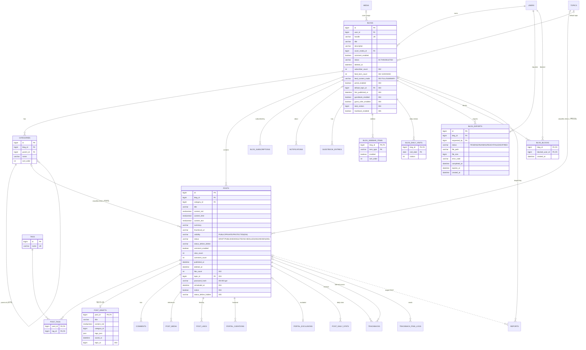
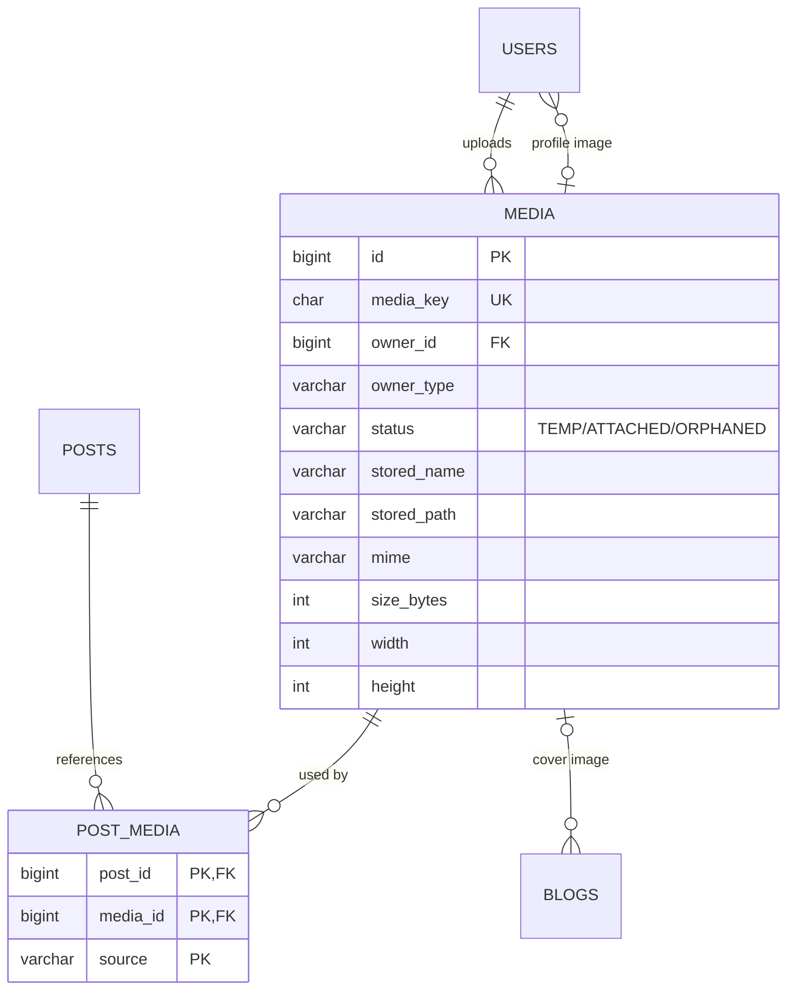
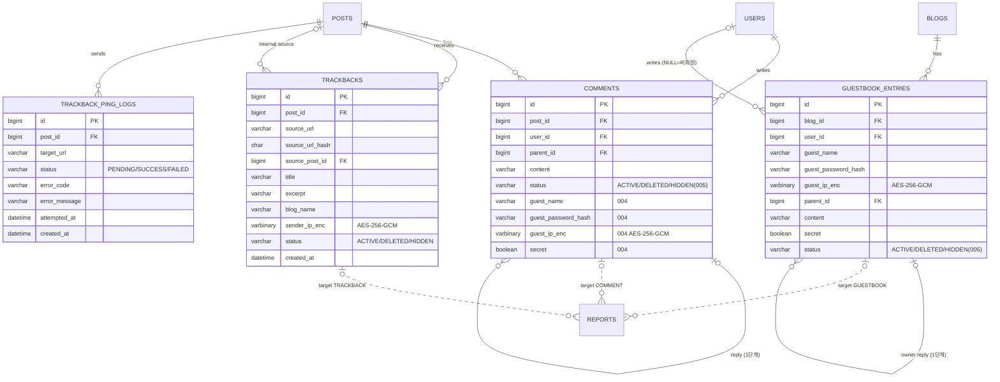
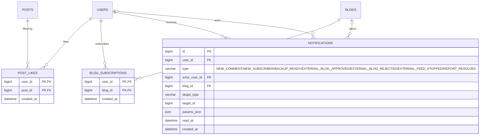
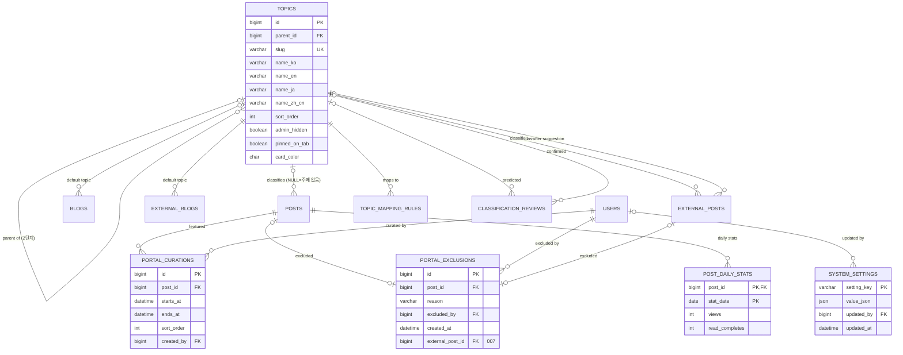
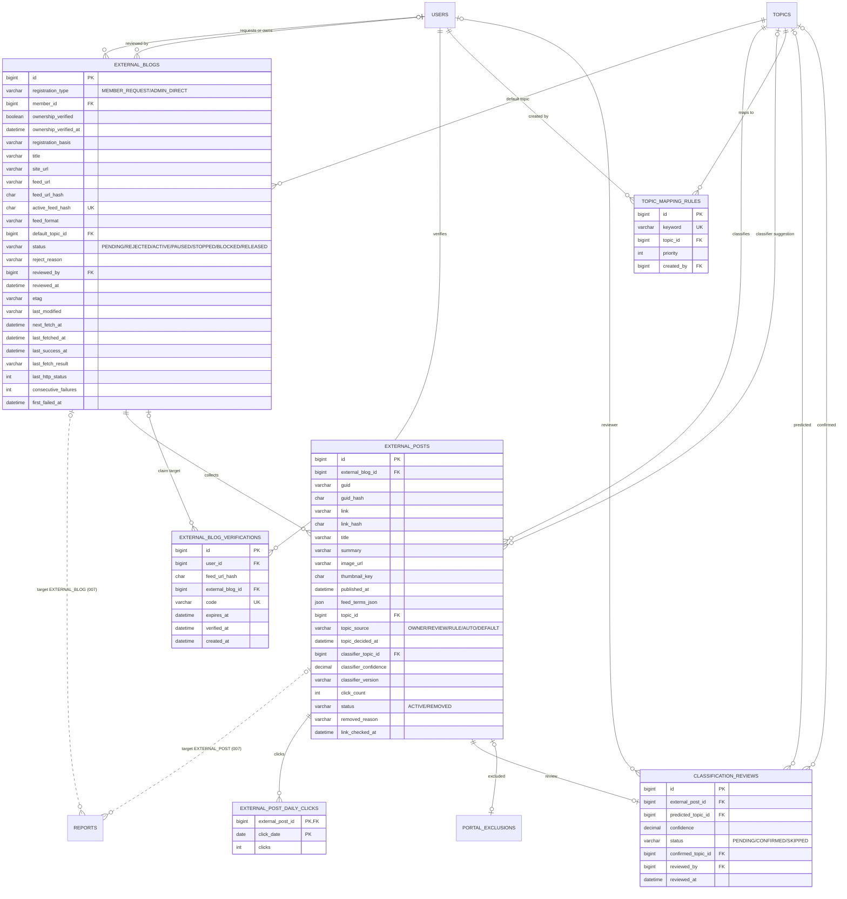
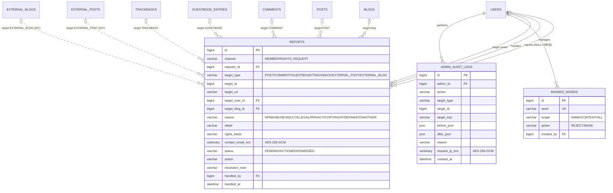
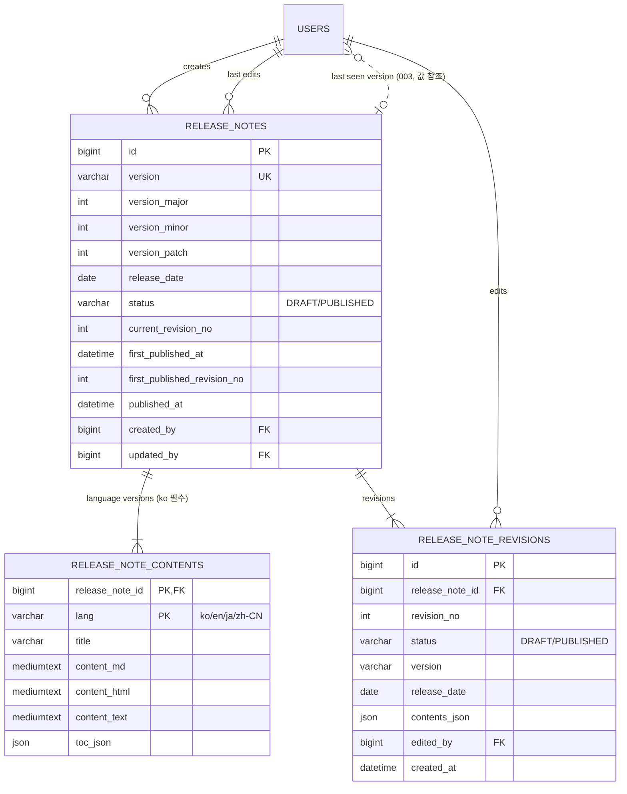

# 전체 ERD (001~007)

001~007 스펙의 data-model을 한 곳에 모은 문서다. 기준은 각 스펙의 data-model.md이며, 이 문서의 테이블·컬럼 이름은 그 파일들과 같다. 스펙이 테이블이나 컬럼을 바꾸면 이 문서도 같은 PR에서 고친다.

- DB 공통 규칙(MySQL 8, utf8mb4, 시간은 UTC `DATETIME(6)`, PK `BIGINT AUTO_INCREMENT`, Crowfoot으로 스키마 관리, 개인정보 AES-256-GCM 암호화)과 글 노출 매트릭스: [001 data-model](specs/001-blog-core/data-model.md)
- 스키마의 원천은 Crowfoot ERD 문서 "blog 1.0"이다. MySQL DDL 스냅숏은 [db/schema-mysql.sql](db/schema-mysql.sql)(Crowfoot export), 바꾸는 순서와 ALTER 기록은 [db/README.md](db/README.md)를 따른다.
- 스펙별 문서: [001](specs/001-blog-core/data-model.md) · [002](specs/002-discovery-feeds/data-model.md) · [003](specs/003-portal/data-model.md) · [004](specs/004-blog-features/data-model.md) · [005](specs/005-trackback-moderation/data-model.md) · [006](specs/006-admin-consoles/data-model.md) · [007](specs/007-external-feeds/data-model.md)
- 다이어그램에서 공통 컬럼(`created_at`, `updated_at`)은 기록 시각 자체가 의미 있는 테이블 외에는 생략했다. 점선 관계는 외래 키 없는 참조(다형 참조, 값 참조)다.

## 1. 테이블 목록

| 스펙 | 테이블 수 |
|---|---|
| 001 | 13 |
| 002 | 3 |
| 003 | 5 |
| 004 | 5 |
| 005 | 4 |
| 006 | 4 |
| 007 | 6 |
| 합계 | 40 |

| # | 테이블 | 정의한 스펙 | 영역 | 설명 | 뒤 스펙이 더한 컬럼 |
|---|---|---|---|---|---|
| 1 | `users` | [001](specs/001-blog-core/data-model.md) | 회원·인증 | 회원, 계정 설정, 권한(USER/ADMIN/SUPER_ADMIN), 블로그 한도 | 003: last_seen_release_version |
| 2 | `refresh_tokens` | [001](specs/001-blog-core/data-model.md) | 회원·인증 | 리프레시 토큰(회전, family) | - |
| 3 | `login_history` | [001](specs/001-blog-core/data-model.md) | 회원·인증 | 로그인 기록(IP 암호화, 3개월) | - |
| 4 | `password_reset_tokens` | [001](specs/001-blog-core/data-model.md) | 회원·인증 | 비밀번호 재설정 토큰 | - |
| 5 | `blogs` | [001](specs/001-blog-core/data-model.md) | 블로그·글 | 블로그(회원당 여러 개), 블로그별 설정 | 002: subscriber_count, feed_item_count, feed_content_mode 003: portal_enabled, default_topic_id, first_published_at 004: guestbook_enabled, guest_write_enabled, total_visitors 005: trackback_enabled |
| 6 | `categories` | [001](specs/001-blog-core/data-model.md) | 블로그·글 | 블로그 카테고리(2단계) | - |
| 7 | `posts` | [001](specs/001-blog-core/data-model.md) | 블로그·글 | 글(공개 범위·상태, 노출 매트릭스의 대상) | 002: like_count 003: topic_id 004: password_hash, scheduled_at, notice, visibility(변경), status(변경) 005: status_before_hidden, status(변경) |
| 8 | `post_drafts` | [001](specs/001-blog-core/data-model.md) | 블로그·글 | 작성 중 사본 | 003: topic_id |
| 9 | `tags` | [001](specs/001-blog-core/data-model.md) | 블로그·글 | 서비스 공통 태그 | - |
| 10 | `post_tags` | [001](specs/001-blog-core/data-model.md) | 블로그·글 | 글-태그 연결 | - |
| 11 | `comments` | [001](specs/001-blog-core/data-model.md) | 소통(댓글·방명록·트랙백) | 댓글(답글 1단계) | 004: guest_name, guest_password_hash, guest_ip_enc, secret, user_id(변경) 005: status(변경) |
| 12 | `media` | [001](specs/001-blog-core/data-model.md) | 미디어 | 업로드 이미지(무작위 키) | - |
| 13 | `post_media` | [001](specs/001-blog-core/data-model.md) | 미디어 | 글-이미지 참조(발행본·작성 중 사본) | - |
| 14 | `post_likes` | [002](specs/002-discovery-feeds/data-model.md) | 탐색·피드·알림 | 좋아요(회원·글 쌍마다 하나) | - |
| 15 | `blog_subscriptions` | [002](specs/002-discovery-feeds/data-model.md) | 탐색·피드·알림 | 블로그 구독 | - |
| 16 | `notifications` | [002](specs/002-discovery-feeds/data-model.md) | 탐색·피드·알림 | 알림(FR-033의 모든 종류) | - |
| 17 | `topics` | [003](specs/003-portal/data-model.md) | 포털·주제 | 서비스 주제(대분류·소분류, 4개 언어 이름) | - |
| 18 | `portal_curations` | [003](specs/003-portal/data-model.md) | 포털·주제 | 운영자 추천 글 | - |
| 19 | `portal_exclusions` | [003](specs/003-portal/data-model.md) | 포털·주제 | 포털 제외(글 단위) | 007: external_post_id, post_id(변경) |
| 20 | `post_daily_stats` | [003](specs/003-portal/data-model.md) | 포털·주제 | 글별 일별 조회·끝까지 읽음 수(인기 점수 입력) | - |
| 21 | `system_settings` | [003](specs/003-portal/data-model.md) | 포털·주제 | 운영자가 콘솔에서 바꾸는 설정값(포털·스팸·외부 피드) | - |
| 22 | `guestbook_entries` | [004](specs/004-blog-features/data-model.md) | 소통(댓글·방명록·트랙백) | 방명록 글(비밀글, 비회원, 주인 답글) | 005: status(변경) |
| 23 | `blog_sidebar_items` | [004](specs/004-blog-features/data-model.md) | 블로그·글 | 블로그 사이드바 항목·순서 | - |
| 24 | `blog_daily_visits` | [004](specs/004-blog-features/data-model.md) | 블로그·글 | 블로그별 일별 방문자 수 | - |
| 25 | `blog_exports` | [004](specs/004-blog-features/data-model.md) | 블로그·글 | 블로그 백업 작업 | - |
| 26 | `blog_blocks` | [004](specs/004-blog-features/data-model.md) | 블로그·글 | 블로그별 회원 차단 | - |
| 27 | `reports` | [005](specs/005-trackback-moderation/data-model.md) | 신고·관리 | 신고(회원 신고 버튼, 비회원 권리 침해 신고 양식) | - |
| 28 | `trackbacks` | [005](specs/005-trackback-moderation/data-model.md) | 소통(댓글·방명록·트랙백) | 받은 트랙백 | - |
| 29 | `trackback_ping_logs` | [005](specs/005-trackback-moderation/data-model.md) | 소통(댓글·방명록·트랙백) | 보낸 트랙백 기록 | - |
| 30 | `banned_words` | [005](specs/005-trackback-moderation/data-model.md) | 신고·관리 | 금칙어 | - |
| 31 | `admin_audit_logs` | [006](specs/006-admin-consoles/data-model.md) | 신고·관리 | 관리자 작업 기록(수정·삭제 불가, 1년) | - |
| 32 | `release_notes` | [006](specs/006-admin-consoles/data-model.md) | 릴리스 노트 | 릴리스 노트(버전별 1행) | - |
| 33 | `release_note_contents` | [006](specs/006-admin-consoles/data-model.md) | 릴리스 노트 | 릴리스 노트 언어판(ko 필수) | - |
| 34 | `release_note_revisions` | [006](specs/006-admin-consoles/data-model.md) | 릴리스 노트 | 릴리스 노트 수정본(저장마다 1행, 불변) | - |
| 35 | `external_blogs` | [007](specs/007-external-feeds/data-model.md) | 외부 피드 | 외부 블로그 등록과 피드 수집 상태 | - |
| 36 | `external_blog_verifications` | [007](specs/007-external-feeds/data-model.md) | 외부 피드 | 외부 블로그 소유 인증 코드 | - |
| 37 | `external_posts` | [007](specs/007-external-feeds/data-model.md) | 외부 피드 | 수집한 외부 글(메타데이터만, 본문 없음) | - |
| 38 | `external_post_daily_clicks` | [007](specs/007-external-feeds/data-model.md) | 외부 피드 | 외부 글 일별 포털 카드 클릭 수 | - |
| 39 | `topic_mapping_rules` | [007](specs/007-external-feeds/data-model.md) | 외부 피드 | 피드 카테고리·태그 → 주제 매핑 규칙 | - |
| 40 | `classification_reviews` | [007](specs/007-external-feeds/data-model.md) | 외부 피드 | 자동 분류 검수 목록 | - |

## 2. 전체 관계도

모든 테이블과 관계. 읽기 쉽도록 속성은 PK·FK·UK와 핵심 컬럼(상태·종류·주소 등)만 넣었다. 전체 속성은 3절의 영역별 관계도에 있다.

```mermaid
erDiagram
    USERS ||--o{ BLOGS : "owns"
    USERS ||--o{ REFRESH_TOKENS : "has"
    USERS ||--o{ LOGIN_HISTORY : "has"
    USERS ||--o{ PASSWORD_RESET_TOKENS : "has"
    BLOGS ||--o{ CATEGORIES : "has"
    CATEGORIES ||--o{ CATEGORIES : "parent of (2단계)"
    BLOGS ||--o{ POSTS : "contains"
    CATEGORIES |o--o{ POSTS : "classifies (NULL=미분류)"
    POSTS ||--o{ POST_TAGS : ""
    TAGS ||--o{ POST_TAGS : ""
    POSTS ||--o| POST_DRAFTS : "작성 중 사본"
    POSTS ||--o{ COMMENTS : "has"
    USERS ||--o{ COMMENTS : "writes"
    COMMENTS |o--o{ COMMENTS : "reply (1단계)"
    USERS ||--o{ MEDIA : "uploads"
    POSTS ||--o{ POST_MEDIA : "references"
    MEDIA ||--o{ POST_MEDIA : "used by"
    MEDIA |o--o{ USERS : "profile image"
    MEDIA |o--o{ BLOGS : "cover image"
    USERS ||--o{ POST_LIKES : "likes"
    POSTS ||--o{ POST_LIKES : "liked by"
    USERS ||--o{ BLOG_SUBSCRIPTIONS : "subscribes"
    BLOGS ||--o{ BLOG_SUBSCRIPTIONS : "subscribed by"
    USERS ||--o{ NOTIFICATIONS : "receives"
    USERS |o--o{ NOTIFICATIONS : "actor"
    BLOGS |o--o{ NOTIFICATIONS : "about"
    TOPICS |o--o{ TOPICS : "parent of (2단계)"
    TOPICS |o--o{ POSTS : "classifies (NULL=주제 없음)"
    TOPICS |o--o{ BLOGS : "default topic"
    POSTS ||--o{ PORTAL_CURATIONS : "featured"
    USERS ||--o{ PORTAL_CURATIONS : "curated by"
    POSTS |o--o| PORTAL_EXCLUSIONS : "excluded"
    USERS ||--o{ PORTAL_EXCLUSIONS : "excluded by"
    POSTS ||--o{ POST_DAILY_STATS : "daily stats"
    USERS |o--o{ SYSTEM_SETTINGS : "updated by"
    BLOGS ||--o{ GUESTBOOK_ENTRIES : "has"
    USERS |o--o{ GUESTBOOK_ENTRIES : "writes (NULL=비회원)"
    GUESTBOOK_ENTRIES |o--o{ GUESTBOOK_ENTRIES : "owner reply (1단계)"
    BLOGS ||--o{ BLOG_SIDEBAR_ITEMS : "sidebar"
    BLOGS ||--o{ BLOG_DAILY_VISITS : "daily visitors"
    BLOGS ||--o{ BLOG_EXPORTS : "exports"
    USERS ||--o{ BLOG_EXPORTS : "requests"
    BLOGS ||--o{ BLOG_BLOCKS : "blocks"
    USERS ||--o{ BLOG_BLOCKS : "blocked"
    POSTS ||--o{ TRACKBACKS : "receives"
    POSTS |o--o{ TRACKBACKS : "internal source"
    POSTS ||--o{ TRACKBACK_PING_LOGS : "sends"
    USERS |o--o{ REPORTS : "reports (NULL=비회원)"
    USERS |o--o{ REPORTS : "handles"
    USERS |o--o{ REPORTS : "target owner"
    BLOGS |o--o{ REPORTS : "target blog"
    USERS ||--o{ BANNED_WORDS : "manages"
    POSTS |o..o{ REPORTS : "target POST"
    COMMENTS |o..o{ REPORTS : "target COMMENT"
    GUESTBOOK_ENTRIES |o..o{ REPORTS : "target GUESTBOOK"
    TRACKBACKS |o..o{ REPORTS : "target TRACKBACK"
    EXTERNAL_POSTS |o..o{ REPORTS : "target EXTERNAL_POST (007)"
    EXTERNAL_BLOGS |o..o{ REPORTS : "target EXTERNAL_BLOG (007)"
    USERS ||--o{ ADMIN_AUDIT_LOGS : "performs"
    USERS ||--o{ RELEASE_NOTES : "creates"
    USERS ||--o{ RELEASE_NOTES : "last edits"
    RELEASE_NOTES ||--|{ RELEASE_NOTE_CONTENTS : "language versions (ko 필수)"
    RELEASE_NOTES ||--|{ RELEASE_NOTE_REVISIONS : "revisions"
    USERS ||--o{ RELEASE_NOTE_REVISIONS : "edits"
    RELEASE_NOTES |o..o{ USERS : "last seen version (003, 값 참조)"
    USERS |o--o{ EXTERNAL_BLOGS : "requests or owns"
    USERS |o--o{ EXTERNAL_BLOGS : "reviewed by"
    TOPICS ||--o{ EXTERNAL_BLOGS : "default topic"
    EXTERNAL_BLOGS ||--o{ EXTERNAL_POSTS : "collects"
    TOPICS ||--o{ EXTERNAL_POSTS : "classifies"
    TOPICS |o--o{ EXTERNAL_POSTS : "classifier suggestion"
    EXTERNAL_POSTS ||--o{ EXTERNAL_POST_DAILY_CLICKS : "clicks"
    USERS ||--o{ EXTERNAL_BLOG_VERIFICATIONS : "verifies"
    EXTERNAL_BLOGS |o--o{ EXTERNAL_BLOG_VERIFICATIONS : "claim target"
    TOPICS ||--o{ TOPIC_MAPPING_RULES : "maps to"
    USERS ||--o{ TOPIC_MAPPING_RULES : "created by"
    EXTERNAL_POSTS ||--o| CLASSIFICATION_REVIEWS : "review"
    TOPICS |o--o{ CLASSIFICATION_REVIEWS : "predicted"
    TOPICS |o--o{ CLASSIFICATION_REVIEWS : "confirmed"
    USERS |o--o{ CLASSIFICATION_REVIEWS : "reviewer"
    EXTERNAL_POSTS |o--o| PORTAL_EXCLUSIONS : "excluded"

    USERS {
        bigint id PK
        char email_hash UK
        bigint profile_media_id FK
        varchar role
        varchar status
    }
    REFRESH_TOKENS {
        bigint id PK
        bigint user_id FK
        char token_hash UK
    }
    LOGIN_HISTORY {
        bigint id PK
        bigint user_id FK
    }
    PASSWORD_RESET_TOKENS {
        bigint id PK
        bigint user_id FK
        char token_hash UK
    }
    BLOGS {
        bigint id PK
        bigint user_id FK
        varchar handle UK
        bigint cover_media_id FK
        varchar status
        bigint default_topic_id FK
    }
    CATEGORIES {
        bigint id PK
        bigint blog_id FK
        bigint parent_id FK
    }
    POSTS {
        bigint id PK
        bigint blog_id FK
        bigint category_id FK
        varchar visibility
        varchar status
        bigint topic_id FK
    }
    POST_DRAFTS {
        bigint post_id PK,FK
    }
    TAGS {
        bigint id PK
        varchar name UK
    }
    POST_TAGS {
        bigint post_id PK,FK
        bigint tag_id PK,FK
    }
    COMMENTS {
        bigint id PK
        bigint post_id FK
        bigint user_id FK
        bigint parent_id FK
        varchar status
    }
    MEDIA {
        bigint id PK
        char media_key UK
        bigint owner_id FK
        varchar status
    }
    POST_MEDIA {
        bigint post_id PK,FK
        bigint media_id PK,FK
        varchar source PK
    }
    POST_LIKES {
        bigint user_id PK,FK
        bigint post_id PK,FK
    }
    BLOG_SUBSCRIPTIONS {
        bigint user_id PK,FK
        bigint blog_id PK,FK
    }
    NOTIFICATIONS {
        bigint id PK
        bigint user_id FK
        varchar type
        bigint actor_user_id FK
        bigint blog_id FK
        varchar target_type
        bigint target_id
    }
    TOPICS {
        bigint id PK
        bigint parent_id FK
        varchar slug UK
    }
    PORTAL_CURATIONS {
        bigint id PK
        bigint post_id FK
        bigint created_by FK
    }
    PORTAL_EXCLUSIONS {
        bigint id PK
        bigint post_id FK
        bigint excluded_by FK
        bigint external_post_id FK
    }
    POST_DAILY_STATS {
        bigint post_id PK,FK
        date stat_date PK
    }
    SYSTEM_SETTINGS {
        varchar setting_key PK
        bigint updated_by FK
    }
    GUESTBOOK_ENTRIES {
        bigint id PK
        bigint blog_id FK
        bigint user_id FK
        bigint parent_id FK
        varchar status
    }
    BLOG_SIDEBAR_ITEMS {
        bigint blog_id PK,FK
        varchar item_type PK
    }
    BLOG_DAILY_VISITS {
        bigint blog_id PK,FK
        date visit_date PK
    }
    BLOG_EXPORTS {
        bigint id PK
        bigint blog_id FK
        bigint requested_by FK
        varchar status
    }
    BLOG_BLOCKS {
        bigint blog_id PK,FK
        bigint blocked_user_id PK,FK
    }
    REPORTS {
        bigint id PK
        varchar channel
        bigint reporter_id FK
        varchar target_type
        bigint target_id
        bigint target_user_id FK
        bigint target_blog_id FK
        varchar status
        bigint handled_by FK
    }
    TRACKBACKS {
        bigint id PK
        bigint post_id FK
        bigint source_post_id FK
        varchar status
    }
    TRACKBACK_PING_LOGS {
        bigint id PK
        bigint post_id FK
        varchar status
    }
    BANNED_WORDS {
        bigint id PK
        varchar word UK
        bigint created_by FK
    }
    ADMIN_AUDIT_LOGS {
        bigint id PK
        bigint admin_id FK
        varchar target_type
        bigint target_id
    }
    RELEASE_NOTES {
        bigint id PK
        varchar version UK
        varchar status
        bigint created_by FK
        bigint updated_by FK
    }
    RELEASE_NOTE_CONTENTS {
        bigint release_note_id PK,FK
        varchar lang PK
    }
    RELEASE_NOTE_REVISIONS {
        bigint id PK
        bigint release_note_id FK
        varchar status
        varchar version
        bigint edited_by FK
    }
    EXTERNAL_BLOGS {
        bigint id PK
        bigint member_id FK
        char active_feed_hash UK
        bigint default_topic_id FK
        varchar status
        bigint reviewed_by FK
    }
    EXTERNAL_BLOG_VERIFICATIONS {
        bigint id PK
        bigint user_id FK
        bigint external_blog_id FK
        varchar code UK
    }
    EXTERNAL_POSTS {
        bigint id PK
        bigint external_blog_id FK
        bigint topic_id FK
        bigint classifier_topic_id FK
        varchar status
    }
    EXTERNAL_POST_DAILY_CLICKS {
        bigint external_post_id PK,FK
        date click_date PK
    }
    TOPIC_MAPPING_RULES {
        bigint id PK
        varchar keyword UK
        bigint topic_id FK
        bigint created_by FK
    }
    CLASSIFICATION_REVIEWS {
        bigint id PK
        bigint external_post_id FK
        bigint predicted_topic_id FK
        varchar status
        bigint confirmed_topic_id FK
        bigint reviewed_by FK
    }
```

## 3. 영역별 관계도

각 영역의 테이블은 뒤 스펙이 더한 컬럼까지 합친 최종 속성을 보여준다(주석의 `002`~`007`은 그 컬럼을 더한 스펙). 다른 영역의 테이블은 관계만 표시했다.

### 3.1 회원·인증

```mermaid
erDiagram
    USERS ||--o{ BLOGS : "owns"
    USERS ||--o{ REFRESH_TOKENS : "has"
    USERS ||--o{ LOGIN_HISTORY : "has"
    USERS ||--o{ PASSWORD_RESET_TOKENS : "has"
    USERS ||--o{ COMMENTS : "writes"
    USERS ||--o{ MEDIA : "uploads"
    MEDIA |o--o{ USERS : "profile image"
    USERS ||--o{ POST_LIKES : "likes"
    USERS ||--o{ BLOG_SUBSCRIPTIONS : "subscribes"
    USERS ||--o{ NOTIFICATIONS : "receives"
    USERS |o--o{ NOTIFICATIONS : "actor"
    USERS ||--o{ PORTAL_CURATIONS : "curated by"
    USERS ||--o{ PORTAL_EXCLUSIONS : "excluded by"
    USERS |o--o{ SYSTEM_SETTINGS : "updated by"
    USERS |o--o{ GUESTBOOK_ENTRIES : "writes (NULL=비회원)"
    USERS ||--o{ BLOG_EXPORTS : "requests"
    USERS ||--o{ BLOG_BLOCKS : "blocked"
    USERS |o--o{ REPORTS : "reports (NULL=비회원)"
    USERS |o--o{ REPORTS : "handles"
    USERS |o--o{ REPORTS : "target owner"
    USERS ||--o{ BANNED_WORDS : "manages"
    USERS ||--o{ ADMIN_AUDIT_LOGS : "performs"
    USERS ||--o{ RELEASE_NOTES : "creates"
    USERS ||--o{ RELEASE_NOTES : "last edits"
    USERS ||--o{ RELEASE_NOTE_REVISIONS : "edits"
    RELEASE_NOTES |o..o{ USERS : "last seen version (003, 값 참조)"
    USERS |o--o{ EXTERNAL_BLOGS : "requests or owns"
    USERS |o--o{ EXTERNAL_BLOGS : "reviewed by"
    USERS ||--o{ EXTERNAL_BLOG_VERIFICATIONS : "verifies"
    USERS ||--o{ TOPIC_MAPPING_RULES : "created by"
    USERS |o--o{ CLASSIFICATION_REVIEWS : "reviewer"

    USERS {
        bigint id PK
        varbinary email_enc "AES-256-GCM"
        char email_hash UK "HMAC-SHA256"
        varchar password_hash
        varchar nickname
        varchar bio
        bigint profile_media_id FK
        varchar role "USER/ADMIN/SUPER_ADMIN"
        varchar status "ACTIVE/SUSPENDED/WITHDRAWN"
        varchar locale
        varchar time_zone
        int failed_login_count
        datetime locked_until
        datetime withdrawn_at
        varchar terms_version
        datetime terms_agreed_at
        int max_blogs
        varchar last_seen_release_version "003"
    }
    REFRESH_TOKENS {
        bigint id PK
        bigint user_id FK
        char family_id
        char token_hash UK
        datetime expires_at
        datetime family_expires_at
        datetime used_at
        bigint replaced_by_id
        datetime revoked_at
    }
    LOGIN_HISTORY {
        bigint id PK
        bigint user_id FK
        boolean success
        varbinary ip_enc "AES-256-GCM"
        varchar user_agent
        datetime created_at
    }
    PASSWORD_RESET_TOKENS {
        bigint id PK
        bigint user_id FK
        char token_hash UK
        datetime expires_at
        datetime used_at
    }
```

### 3.2 블로그·글

### 3.3 미디어

### 3.4 소통(댓글·방명록·트랙백)

### 3.5 탐색·피드·알림

### 3.6 포털·주제

### 3.7 외부 피드

### 3.8 신고·관리

### 3.9 릴리스 노트

## 4. 저장 테이블을 두지 않는 것

| 기능 | 처리 | 근거 |
|---|---|---|
| 조회수 중복 방지, 보호 글 비밀번호 실패 횟수, 방문자 하루 1회 판단 | backend 메모리(Caffeine) | 001 research R10, R18, R19 |
| 작성 속도 제한, 반복 댓글 스팸, 트랙백 출처별 제한 | backend 메모리, 한도 값은 `system_settings` | 005 data-model |
| 인기 점수(내부·외부 글), 주제 자동 숨김, 포털 목록 | 조회 결과 5분 캐시 | 003·007 data-model |
| 썸네일 | 파일(`blog.media.thumbnail-dir`) | 001 data-model |
| 예약어 | backend 코드 상수 | 001 contracts/routes.md |
| 관리자 권한, 회원별 블로그 한도 | `users.role`, `users.max_blogs` | 001 data-model, 006 |
