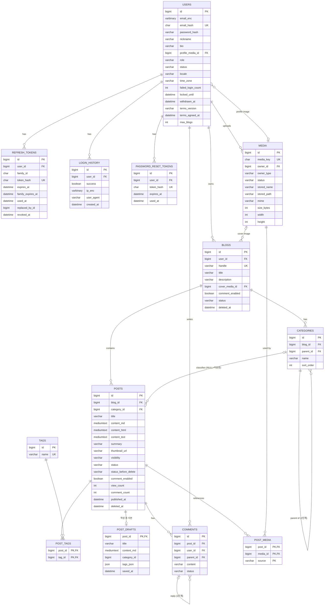

# Data Model: 001 블로그 핵심

> 002~007 스펙에서 추가될 테이블(좋아요, 구독, 알림, 통계, 주제·포털, 방명록·백업·차단, 신고·트랙백, 관리자 작업 기록, 외부 블로그 등)과 기존 테이블의 컬럼·값 추가(아래 각 표에 "NNN에서 추가"로 표시)는 각 스펙의 data-model에 적고 Crowfoot 문서에 반영한다([db/README.md](../../db/README.md)). 001~007 전체 테이블과 관계는 [erd.md](../../erd.md)에 모았다.

DB: MySQL 8, utf8mb4, 모든 시간은 UTC `DATETIME(6)`. PK는 `BIGINT AUTO_INCREMENT`. 공통 컬럼 `created_at`, `updated_at`.

## ERD

## users
| 컬럼 | 타입 | 제약 / 규칙 |
|---|---|---|
| id | BIGINT | PK |
| email_enc | VARBINARY(512) | AES-256-GCM 암호문(키 버전 + IV + 암호문 + 태그), 소문자 정규화 후 암호화 (FR-134) |
| email_hash | CHAR(64) | UNIQUE, HMAC-SHA256(정규화된 이메일, 검색용 키). 로그인·중복 확인·관리자 정확 검색 (FR-135) |
| password_hash | VARCHAR(100) | BCrypt (FR-003) |
| nickname | VARCHAR(30) | 필수 |
| bio | VARCHAR(300) | |
| profile_media_id | BIGINT | FK media(owner_type=PROFILE), NULL 가능. 응답의 `profileImageUrl`은 `/media/{media_key}` |
| role | VARCHAR(15) | USER(일반 회원) / ADMIN(일반 관리자) / SUPER_ADMIN(최고 관리자) (006 FR-105). 첫 SUPER_ADMIN은 운영 설정 프로퍼티로 지정 |
| status | VARCHAR(10) | ACTIVE / SUSPENDED / WITHDRAWN |
| failed_login_count | INT | 기본 0 (FR-007) |
| locked_until | DATETIME(6) | NULL 가능 |
| locale | VARCHAR(10) | ko / en / ja / zh-CN, NULL=미설정(방문자 쿠키·브라우저 언어로 결정) (FR-149) |
| time_zone | VARCHAR(40) | IANA 시간대 ID, 기본 `Asia/Seoul` (FR-153) |
| withdrawn_at | DATETIME(6) | 탈퇴 시각, 이로부터 30일 후 개인정보 파기 (FR-138) |
| terms_version | VARCHAR(20) | 동의한 약관 버전 (FR-081). 4개 언어 공통 하나의 버전, 기준은 한국어판 (FR-155) |
| terms_agreed_at | DATETIME(6) | 동의 일시 |
| max_blogs | INT | 회원별 블로그 한도, NULL=기본값(`blog.blogs.default-max-per-member`, 기본 3) 사용. 0 이상. 관리자만 바꾼다 (FR-158, 006 FR-160) |

상태 전이: ACTIVE ↔ SUSPENDED(관리자), ACTIVE → WITHDRAWN(본인, 되돌릴 수 없음, 복구 기능 없음). WITHDRAWN 전이 시 그 회원의 모든 블로그의 모든 글 visibility=PRIVATE(이전 값은 보관하지 않음), 모든 리프레시 토큰 무효화(FR-009). 30일(보존 기간) 뒤 파기 작업이 email_enc·nickname·bio 등 개인정보를 지우거나 익명 값으로 바꾼다(FR-138). 007에서는 이때 그 회원의 외부 블로그 등록도 수집을 멈추고 수집된 글을 포털에서 내린다(007 FR-157).

## refresh_tokens
| 컬럼 | 타입 | 제약 |
|---|---|---|
| id | BIGINT | PK |
| user_id | BIGINT | FK users |
| family_id | CHAR(36) | 한 번의 로그인에서 이어진 토큰 묶음(UUID) |
| token_hash | CHAR(64) | UNIQUE, SHA-256 |
| expires_at | DATETIME(6) | 발급 + 4시간(유휴 만료) |
| family_expires_at | DATETIME(6) | family 최초 발급 + 7일(절대 만료) |
| used_at | DATETIME(6) | 교체되어 사용 처리된 시각 |
| replaced_by_id | BIGINT | 교체로 새로 발급된 토큰 |
| revoked_at | DATETIME(6) | 로그아웃·재사용 감지·정지·탈퇴 시 설정 |

## blogs
| 컬럼 | 타입 | 제약 |
|---|---|---|
| id | BIGINT | PK |
| user_id | BIGINT | FK users, 인덱스. 한 회원이 여러 블로그를 가짐 (FR-010) |
| handle | VARCHAR(20) | UNIQUE(삭제된 블로그 포함), 규칙·예약어 검사, 변경 불가 (FR-002). 삭제된 블로그의 주소도 다시 쓸 수 없음 (FR-159) |
| title | VARCHAR(100) | 기본값 "{닉네임}의 블로그" |
| description | VARCHAR(500) | |
| cover_media_id | BIGINT | FK media(owner_type=BLOG_COVER), NULL 가능. 응답의 `coverImageUrl`은 `/media/{media_key}` |
| comment_enabled | BOOLEAN | 기본 true (FR-029) |
| status | VARCHAR(10) | ACTIVE / DELETED (FR-159) |
| deleted_at | DATETIME(6) | 블로그 삭제 시각 |

인덱스: (user_id, status) 회원의 블로그 목록·한도 계산용.

- **만들기 (FR-158)**: 가입 시 첫 블로그를 같은 트랜잭션에서 만든다. 그 뒤의 블로그는 한 트랜잭션에서 `SELECT ... FROM users WHERE id = ? FOR UPDATE`로 회원 행을 잠그고, `status = ACTIVE`인 블로그 수가 `COALESCE(users.max_blogs, blog.blogs.default-max-per-member)` 이상이면 거부(`BLOG_LIMIT_EXCEEDED`), 아니면 INSERT한다. 같은 회원의 동시 요청은 이 잠금에서 차례로 처리되므로 한도를 넘지 않는다(research R28). handle 중복은 UNIQUE 제약이 최종 판단한다. 한도가 지금 블로그 수보다 낮아져도 기존 행은 건드리지 않는다.
- **삭제 (FR-159)**: 같은 회원 행 잠금 안에서 ACTIVE 블로그가 2개 이상일 때만 `status = DELETED`, `deleted_at` 설정(아니면 `LAST_BLOG_CANNOT_BE_DELETED`). 그 블로그의 DELETED가 아닌 글은 모두 휴지통 규칙대로 `status = DELETED`, `status_before_delete`, `deleted_at = 지금`으로 바꾼다(복구 화면은 없음). 삭제 즉시 블로그 홈·글 상세·피드 등은 404이고, 30일 뒤 휴지통 비우기 작업이 글을 영구 삭제하면서 카테고리·대표 이미지 참조와 002~005가 더하는 블로그별 데이터(구독·방명록·방문자 통계·설정 등)도 지운다. `blogs` 행은 주소를 다시 쓰지 못하게 남겨 두며(title·description은 비움), 되돌릴 수 없다.
- **탈퇴**: 회원의 모든 블로그에 users 상태 전이 규칙이 적용된다(블로그 status는 바꾸지 않음).

## categories
| 컬럼 | 타입 | 제약 |
|---|---|---|
| id | BIGINT | PK |
| blog_id | BIGINT | FK blogs |
| parent_id | BIGINT | FK categories, NULL=상위. 부모의 parent_id는 NULL이어야 함(2단계, FR-023) |
| name | VARCHAR(50) | 같은 부모 아래 UNIQUE |
| sort_order | INT | |

삭제 시 소속 글의 category_id를 NULL(=미분류)로 변경, 하위 카테고리가 있으면 하위의 글도 미분류로 옮기고 하위 카테고리도 삭제(FR-024).

## posts
| 컬럼 | 타입 | 제약 |
|---|---|---|
| id | BIGINT | PK, 글 주소의 글번호 |
| blog_id | BIGINT | FK blogs |
| category_id | BIGINT | FK categories, NULL=미분류 |
| title | VARCHAR(200) | 필수 |
| content_md | MEDIUMTEXT | 원문 Markdown |
| content_html | MEDIUMTEXT | 변환·살균된 HTML (FR-021) |
| content_text | MEDIUMTEXT | 태그 제거 텍스트, FULLTEXT ngram |
| summary | VARCHAR(300) | content_text 앞 150자, 메타 description |
| thumbnail_url | VARCHAR(500) | 발행 설정에서 선택한 대표 이미지(기본은 본문 첫 이미지), `/media/{media_key}` 형식. PublishSettings의 `thumbnailMediaKey`로 지정 (FR-107) |
| visibility | VARCHAR(10) | PUBLIC / PRIVATE (FR-015). 004에서 PROTECTED 추가(보호 글, `password_hash` 컬럼도 004에서 추가) |
| status | VARCHAR(10) | DRAFT / PUBLISHED / DELETED (004에서 SCHEDULED, 005에서 HIDDEN 추가) |
| status_before_delete | VARCHAR(10) | 휴지통으로 옮기기 직전 status. 복구 시 이 값으로 되돌림 (FR-084). visibility는 삭제 중에도 바뀌지 않으므로 따로 두지 않음 |
| view_count, comment_count | INT | 비정규화 카운터 (like_count는 002에서 추가) |
| published_at | DATETIME(6) | 최초 발행 시각 |
| comment_enabled | BOOLEAN | 글별 댓글 허용 (FR-107), 블로그 설정이 꺼져 있으면 무시 |
| deleted_at | DATETIME(6) | 휴지통 이동 시각, 30일 후 영구 삭제 (FR-084) |

인덱스: (blog_id, status, visibility, published_at DESC), (category_id). 검색용 FULLTEXT는 002에서 추가.

### 노출 조건 (FR-018)

두 조건을 리포지토리 한 곳의 공통 스펙/쿼리 조각으로만 표현하고, 모든 목록·검색·피드·사이트맵·포털 쿼리는 이 조각을 쓴다.

- **목록 노출 가능**: `status = PUBLISHED AND visibility IN (PUBLIC, PROTECTED) AND 작성자 users.status = ACTIVE`. 글이 목록에 "제목으로라도" 나올 수 있는 조건. 004 전에는 PROTECTED 값이 없으므로 `visibility = PUBLIC`과 같다.
- **본문 노출 가능**: `목록 노출 가능 AND visibility = PUBLIC`. 본문·요약·대표 이미지를 비밀번호 확인 없이 보여도 되는 조건. 사이트맵과 포털은 이 조건을 쓴다.

보호 글(PROTECTED)의 본문은 글 상세에서 비밀번호를 확인한 방문자에게만 보인다(004 FR-062, research R18). 이는 방문자별 예외이며 위 두 조건을 바꾸지 않는다.

### 글 노출 매트릭스 (기준표)

모든 스펙의 글 노출 규칙은 이 표를 기준으로 한다(001 FR-018, 002 FR-047, 003 FR-088, 004 FR-062·064, 005 FR-041, SC-004). 다른 스펙은 규칙을 다시 쓰지 않고 이 표를 참조하며, 새 상태나 공개 범위를 추가하는 스펙은 이 표에 행을 더한다. "주인 외"는 글 주인이 아닌 모든 사람(비로그인 포함, 관리자 포함)이다. 글 주인은 자기 글을 상태와 관계없이 블로그 관리(`/:handle/manage/posts`)와 글 상세에서 볼 수 있다(DELETED는 휴지통에서만).

| 상태 | 공개 범위 | 작성자 상태 | 상세(주인 외) | 블로그 목록 (홈·카테고리·태그·보관함·구독 피드·관련 글) | 피드 (RSS·Atom) | 검색 | 사이트맵 | 포털 (003) |
|---|---|---|---|---|---|---|---|---|
| PUBLISHED | PUBLIC | ACTIVE | 전체 | 제목·요약·대표 이미지 | 전문 또는 요약(002 FR-046) | 제목·본문·태그 검색, 요약 표시 | 포함 | 003 FR-088 조건을 모두 만족할 때만 |
| PUBLISHED | PROTECTED (004) | ACTIVE | 제목 + 비밀번호 입력란, 맞는 비밀번호 후 본문 | 제목만(요약·대표 이미지 없음) | 제목·링크만(본문·요약 없음) | 제목만 검색 대상, 결과도 제목만 | 제외 | 제외 |
| PUBLISHED | PRIVATE | ACTIVE | 404 | 제외 | 제외 | 제외 | 제외 | 제외 |
| DRAFT | 모두 | 모두 | 404 | 제외 | 제외 | 제외 | 제외 | 제외 |
| SCHEDULED (004) | 모두 | 모두 | 404 (예약 시각에 PUBLISHED로 바뀐 뒤 위 행을 따름) | 제외 | 제외 | 제외 | 제외 | 제외 |
| DELETED | 모두 | 모두 | 404 | 제외 | 제외 | 제외 | 제외 | 제외 |
| HIDDEN (005) | 모두 | 모두 | 404 (작성자에게는 숨김 안내와 함께 보임) | 제외 | 제외 | 제외 | 제외 | 제외 |
| 모두 | 모두 | SUSPENDED | 404 (블로그는 "이용이 제한된 블로그" 안내, 005 FR-042) | 제외 | 제외 | 제외 | 제외 | 제외 |
| 모두 | 모두 | WITHDRAWN | 404 (탈퇴 시 모든 글 PRIVATE) | 제외 | 제외 | 제외 | 제외 | 제외 |

- 포털 제외(003 FR-093)와 블로그의 포털 노출 끄기(003 FR-089)는 포털 열에만 영향을 준다.
- 삭제된 블로그(FR-159)의 글은 블로그를 삭제할 때 모두 DELETED가 되므로 DELETED 행을 따른다.
- 외부 블로그 글(007)은 이 표의 대상이 아니며 포털에만 나온다(007 FR-123~125).
- 상세가 404인 경우 응답은 "존재하지 않는 글"과 구분되지 않아야 한다.

### 상태 전이

DRAFT → PUBLISHED(발행), PUBLISHED → DRAFT 불가. DRAFT/PUBLISHED → DELETED(주인, 휴지통): 직전 status를 `status_before_delete`에 저장하고 `deleted_at` 설정. DELETED → `status_before_delete`(30일 내 복구, FR-084, 공개 범위는 그대로이므로 삭제 전 상태로 돌아옴). DELETED 후 30일이 지나면 정리 작업이 영구 삭제하고 그 글의 `post_media` 행을 지운 뒤 이미지 정리 대상 여부를 다시 판단한다(FR-073).

## post_drafts
발행된 글을 수정하는 동안의 작성본과, 아직 발행되지 않은 글의 작성본 (FR-016, FR-108).

| 컬럼 | 타입 | 제약 |
|---|---|---|
| post_id | BIGINT | PK, FK posts |
| title | VARCHAR(200) | |
| content_md | MEDIUMTEXT | |
| category_id | BIGINT | |
| tags_json | JSON | |
| saved_at | DATETIME(6) | 자동저장 시각 |

새 글: posts(status=DRAFT) 행 + post_drafts 행 생성. 발행: post_drafts 내용을 posts에 반영(HTML 변환·살균), post_drafts 삭제. 발행된 글 수정: post_drafts만 갱신, `publish` 때 반영. 작성 중 사본 폐기(`DELETE /posts/{id}/draft`): 발행된 글이면 post_drafts 행만 지우고 발행본은 그대로 둔다. 매 저장·발행·폐기 때 `post_media`를 갱신한다(아래 media).

## tags / post_tags
- tags: id, name VARCHAR(30) UNIQUE. 정규화는 앞뒤 공백 제거(trim) + 소문자 변환이며, 단어 사이 공백은 그대로 둔다(예: " Spring Boot " → "spring boot"). FULLTEXT 불필요.
- post_tags: (post_id, tag_id) PK. 글당 최대 10개(서비스 검증, FR-025).

## comments
| 컬럼 | 타입 | 제약 |
|---|---|---|
| id | BIGINT | PK |
| post_id | BIGINT | FK posts |
| user_id | BIGINT | FK users |
| parent_id | BIGINT | NULL=댓글, 값=답글. 부모의 parent_id는 NULL이어야 함(1단계, FR-027) |
| content | VARCHAR(1000) | 일반 텍스트 |
| status | VARCHAR(10) | ACTIVE / DELETED. 005에서 HIDDEN(관리자 숨김) 추가. 004의 방명록(guestbook_entries)과 005의 트랙백(trackbacks)도 같은 ACTIVE / DELETED / HIDDEN 값을 쓴다 |

답글이 있는 댓글을 삭제하면 "삭제된 댓글입니다"로 자리만 남긴다.

## post_view_dedup
테이블 없음. 조회수 중복 방지는 프로세스 내 캐시(Caffeine, 키 postId+방문자키, TTL 30분)로 처리 (FR-020, research R10).

## media
| 컬럼 | 타입 | 제약 |
|---|---|---|
| id | BIGINT | PK, 내부 식별용(주소에 쓰지 않음) |
| media_key | CHAR(22) | UNIQUE, 무작위 128비트를 base62로 표현한 22자. 이미지 주소 `/media/{media_key}`의 키 (FR-156) |
| owner_id | BIGINT | FK users, 올린 회원 |
| owner_type | VARCHAR(12) | POST(에디터 업로드, 기본) / PROFILE(프로필 이미지) / BLOG_COVER(블로그 대표 이미지). 업로드 요청의 `purpose`로 정함 |
| status | VARCHAR(10) | TEMP / ATTACHED / ORPHANED |
| stored_name | VARCHAR(100) | `{uuid}.{ext}`, 원래 파일 이름은 쓰지 않음 (FR-039) |
| stored_path | VARCHAR(300) | 기준 디렉터리(temp-dir 또는 upload-dir)로부터의 상대 경로 |
| mime | VARCHAR(20) | image/jpeg, image/png, image/gif, image/webp |
| size_bytes | INT | ≤ blog.media.max-size |
| width, height | INT | 원본 픽셀 크기. 업로드 시 읽어 저장, 썸네일이 원본을 넘지 않게 하는 데 사용 (FR-132) |

인덱스: (status, created_at) 정리 작업용, (owner_id, status) 임시 한도 계산용.

## post_media
글과 이미지의 참조 관계. 한 이미지를 같은 회원의 여러 글이 쓸 수 있다 (FR-071, FR-073).

| 컬럼 | 타입 | 제약 |
|---|---|---|
| post_id | BIGINT | PK, FK posts |
| media_id | BIGINT | PK, FK media |
| source | VARCHAR(10) | PK. PUBLISHED(발행본 본문·대표 이미지가 참조) / DRAFT(작성 중 사본이 참조) |

- 작성 중 사본 저장: 그 글의 DRAFT 행을 본문의 `/media/{key}` 참조로 교체.
- 발행: PUBLISHED 행을 새 본문 기준으로 교체하고 DRAFT 행 삭제(post_drafts도 삭제).
- 작성 중 사본 폐기: DRAFT 행만 삭제.
- 휴지통(DELETED)에 있는 30일 동안은 행을 그대로 둔다. 영구 삭제 때 그 글의 행을 모두 삭제.
- 글 작성자 본인이 올린 이미지만 연결한다. 다른 회원의 이미지 주소를 본문에 넣어도 연결하지 않는다(남의 이미지의 정리를 막지 못하게).

## 썸네일
테이블 없음. 파일은 `blog.media.thumbnail-dir/{media_key}/{w}x{h}-{fit}.{ext}`에 저장하고, 있으면 그대로 준다. 원본(media 행)이 삭제되면 `{media_key}` 디렉터리를 통째로 지운다 (FR-130~132, research R11).

## 이미지 상태 전이 (FR-071~074, FR-156)
- 업로드 → TEMP (temp-dir에 저장). 회원의 TEMP 합계가 temp-quota를 넘으면 업로드 거부. TEMP 이미지는 올린 회원에게만 제공하고 그 외에는 404.
- 글 저장·발행 시 본문이 참조(owner_type=POST) → ATTACHED (upload-dir로 이동, post_media 행 생성).
- 프로필·블로그 대표 이미지로 저장(PATCH /me, PATCH /blogs/{handle}) → ATTACHED (upload-dir로 이동, users.profile_media_id 또는 blogs.cover_media_id 설정). 이전 이미지는 아래 판단 대상.
- **정리 대상 판단**: 이미지를 참조하는 `post_media` 행(발행본·작성 중 사본, 휴지통 글 포함)이 하나도 없고 `users.profile_media_id`·`blogs.cover_media_id`도 참조하지 않으면 ORPHANED. 발행, 작성 중 사본 저장·폐기, 글 영구 삭제, 프로필·대표 이미지 변경 때 영향을 받은 이미지에 대해 다시 판단한다. 작성 중 사본에서만 빠진 이미지는 PUBLISHED 행이 남아 있으므로 ORPHANED가 되지 않는다.
- TEMP이고 created_at + temp-ttl 경과, 또는 ORPHANED → 정리 작업이 파일·썸네일·행 삭제.
- ORPHANED 이미지를 다시 참조하면(정리 전까지) ATTACHED로 복구.
- 등록된(ATTACHED) 이미지는 주소를 아는 누구에게나 제공한다. 비공개·임시저장·휴지통 글의 이미지도 주소를 알면 열리며, 주소 키를 추측할 수 없으므로 이를 받아들인 절충으로 둔다(티스토리와 같은 수준).

## login_history
| 컬럼 | 타입 | 제약 |
|---|---|---|
| id | BIGINT | PK |
| user_id | BIGINT | FK users, NULL(존재하지 않는 이메일 시도) |
| success | BOOLEAN | |
| ip_enc | VARBINARY(128) | 암호화된 접속 IP (FR-134) |
| user_agent | VARCHAR(300) | |
| created_at | DATETIME(6) | 3개월 후 파기 (FR-139) |

## password_reset_tokens
| 컬럼 | 타입 | 제약 |
|---|---|---|
| id | BIGINT | PK |
| user_id | BIGINT | FK users |
| token_hash | CHAR(64) | UNIQUE, SHA-256 |
| expires_at | DATETIME(6) | 발급 + 30분 |
| used_at | DATETIME(6) | 한 번만 사용 (FR-133) |

## 개인정보 암호화 규칙 (FR-134~136)
- 방식: AES-256-GCM, 값마다 무작위 IV. JPA `AttributeConverter`로 저장 시 암호화, 조회 시 복호화.
- 암호문 형식: `[키 버전 1바이트][IV 12바이트][암호문][태그 16바이트]`. 키 버전으로 교체 전 데이터도 복호화.
- 검색용 해시: 암호문은 같은 값도 매번 달라 검색이 안 되므로, 별도 키로 만든 HMAC-SHA256 값을 `*_hash` 컬럼에 둔다.
- 키: 프로퍼티 `blog.crypto.keys`(버전별 Base64 키), `blog.crypto.active-key-version`, `blog.crypto.hash-key`. 값은 환경 변수나 서버의 외부 설정 파일로 주입하고 저장소에 커밋하지 않는다.
- 키 교체: 새 버전 키 추가 → active 버전 변경 → 배치 작업이 이전 버전 암호문을 새 키로 재암호화 → 완료 후 이전 키 제거. 해시 키는 바꾸지 않는다(바꾸면 전체 재계산 필요).
