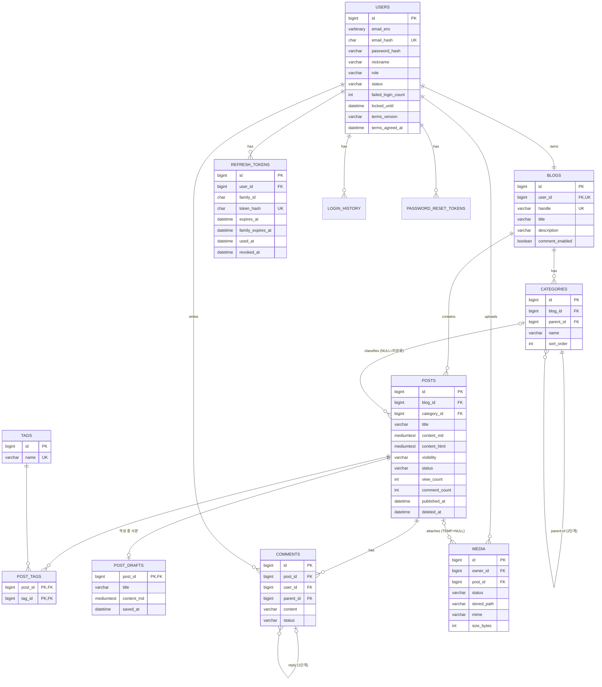

# Data Model: 001 블로그 핵심

> 002~005 스펙에서 추가될 테이블(좋아요, 구독, 알림, 통계, 신고, 트랙백, 방명록 등)은 각 스펙의 data-model에서 Flyway 마이그레이션으로 더한다.

DB: MySQL 8, utf8mb4, 모든 시간은 UTC `DATETIME(6)`. PK는 `BIGINT AUTO_INCREMENT`. 공통 컬럼 `created_at`, `updated_at`.

## ERD

## users
| 컬럼 | 타입 | 제약 / 규칙 |
|---|---|---|
| id | BIGINT | PK |
| email_enc | VARBINARY(512) | AES-256-GCM 암호문(키 버전 + IV + 암호문 + 태그), 소문자 정규화 후 암호화 (FR-134) |
| email_hash | CHAR(64) | UNIQUE, HMAC-SHA256(정규화된 이메일, 검색용 키). 로그인·중복 확인·관리자 정확 검색 (FR-135) |
| password_hash | VARCHAR(100) | BCrypt (FR-003) |
| nickname | VARCHAR(30) | 필수 |
| bio | VARCHAR(300) | |
| profile_image_url | VARCHAR(500) | |
| role | VARCHAR(15) | USER / ADMIN / SUPER_ADMIN (006 FR-105) |
| status | VARCHAR(10) | ACTIVE / SUSPENDED / WITHDRAWN |
| failed_login_count | INT | 기본 0 (FR-007) |
| locked_until | DATETIME(6) | NULL 가능 |
| withdrawn_at | DATETIME(6) | |
| terms_version | VARCHAR(20) | 동의한 약관 버전 (FR-081) |
| terms_agreed_at | DATETIME(6) | 동의 일시 |

상태 전이: ACTIVE ↔ SUSPENDED(관리자), ACTIVE → WITHDRAWN(본인, 되돌릴 수 없음). WITHDRAWN 전이 시 그 회원의 모든 글 visibility=PRIVATE, 모든 리프레시 토큰 무효화(FR-009).

## refresh_tokens
| 컬럼 | 타입 | 제약 |
|---|---|---|
| id | BIGINT | PK |
| user_id | BIGINT | FK users |
| family_id | CHAR(36) | 한 번의 로그인에서 이어진 토큰 묶음(UUID) |
| token_hash | CHAR(64) | UNIQUE, SHA-256 |
| expires_at | DATETIME(6) | 발급 + 4시간(유휴 만료) |
| family_expires_at | DATETIME(6) | family 최초 발급 + 7일(절대 만료) |
| used_at | DATETIME(6) | 교체되어 사용 처리된 시각 |
| replaced_by_id | BIGINT | 교체로 새로 발급된 토큰 |
| revoked_at | DATETIME(6) | 로그아웃·재사용 감지·정지·탈퇴 시 설정 |

## blogs
| 컬럼 | 타입 | 제약 |
|---|---|---|
| id | BIGINT | PK |
| user_id | BIGINT | FK users, UNIQUE (FR-010) |
| handle | VARCHAR(20) | UNIQUE, 규칙·예약어 검사, 변경 불가 (FR-002) |
| title | VARCHAR(100) | 기본값 "{닉네임}의 블로그" |
| description | VARCHAR(500) | |
| cover_image_url | VARCHAR(500) | |
| comment_enabled | BOOLEAN | 기본 true (FR-029) |

## categories
| 컬럼 | 타입 | 제약 |
|---|---|---|
| id | BIGINT | PK |
| blog_id | BIGINT | FK blogs |
| parent_id | BIGINT | FK categories, NULL=상위. 부모의 parent_id는 NULL이어야 함(2단계, FR-023) |
| name | VARCHAR(50) | 같은 부모 아래 UNIQUE |
| sort_order | INT | |

삭제 시 소속 글의 category_id를 NULL(=미분류)로 변경, 하위 카테고리가 있으면 하위의 글도 미분류로 옮기고 하위 카테고리도 삭제(FR-024).

## posts
| 컬럼 | 타입 | 제약 |
|---|---|---|
| id | BIGINT | PK, 글 주소의 글번호 |
| blog_id | BIGINT | FK blogs |
| category_id | BIGINT | FK categories, NULL=미분류 |
| title | VARCHAR(200) | 필수 |
| content_md | MEDIUMTEXT | 원문 Markdown |
| content_html | MEDIUMTEXT | 변환·살균된 HTML (FR-021) |
| content_text | MEDIUMTEXT | 태그 제거 텍스트, FULLTEXT ngram |
| summary | VARCHAR(300) | content_text 앞 150자, 메타 description |
| thumbnail_url | VARCHAR(500) | 본문 첫 이미지 |
| visibility | VARCHAR(10) | PUBLIC / PRIVATE (FR-015) |
| status | VARCHAR(10) | DRAFT / PUBLISHED / DELETED (004에서 SCHEDULED, 005에서 HIDDEN 추가) |
| view_count, comment_count | INT | 비정규화 카운터 (like_count는 002에서 추가) |
| published_at | DATETIME(6) | 최초 발행 시각 |
| comment_enabled | BOOLEAN | 글별 댓글 허용 (FR-107), 블로그 설정이 꺼져 있으면 무시 |
| deleted_at | DATETIME(6) | 휴지통 이동 시각, 30일 후 영구 삭제 (FR-084) |

인덱스: (blog_id, status, visibility, published_at DESC), (category_id). 검색용 FULLTEXT는 002에서 추가.

"공개 노출 가능" 조건(모든 목록·검색·피드·사이트맵·RSS 공통, FR-018):
`status = PUBLISHED AND visibility = PUBLIC AND 작성자 users.status = ACTIVE`. 이 조건은 리포지토리 한 곳의 공통 스펙/쿼리 조각으로만 표현한다.

상태 전이: DRAFT → PUBLISHED(발행), PUBLISHED → DRAFT 불가, DRAFT/PUBLISHED → DELETED(주인, 휴지통). DELETED → 이전 상태(30일 내 복구, FR-084). DELETED 후 30일이 지나면 영구 삭제하고 그 글의 이미지를 ORPHANED로 표시(FR-073).

## post_drafts
발행된 글을 수정하는 동안의 작성본과, 아직 발행되지 않은 글의 작성본 (FR-016, FR-108).

| 컬럼 | 타입 | 제약 |
|---|---|---|
| post_id | BIGINT | PK, FK posts |
| title | VARCHAR(200) | |
| content_md | MEDIUMTEXT | |
| category_id | BIGINT | |
| tags_json | JSON | |
| saved_at | DATETIME(6) | 자동저장 시각 |

새 글: posts(status=DRAFT) 행 + post_drafts 행 생성. 발행: post_drafts 내용을 posts에 반영(HTML 변환·살균), post_drafts 삭제. 발행된 글 수정: post_drafts만 갱신, `publish` 때 반영.

## tags / post_tags
- tags: id, name VARCHAR(30) UNIQUE(소문자·앞뒤 공백 제거로 정규화), FULLTEXT 불필요.
- post_tags: (post_id, tag_id) PK. 글당 최대 10개(서비스 검증, FR-025).

## comments
| 컬럼 | 타입 | 제약 |
|---|---|---|
| id | BIGINT | PK |
| post_id | BIGINT | FK posts |
| user_id | BIGINT | FK users |
| parent_id | BIGINT | NULL=댓글, 값=답글. 부모의 parent_id는 NULL이어야 함(1단계, FR-027) |
| content | VARCHAR(1000) | 일반 텍스트 |
| status | VARCHAR(10) | ACTIVE / DELETED |

답글이 있는 댓글을 삭제하면 "삭제된 댓글입니다"로 자리만 남긴다.

## post_view_dedup
테이블 없음. 조회수 중복 방지는 프로세스 내 캐시(Caffeine, 키 postId+방문자키, TTL 30분)로 처리 (FR-020, research R10).

## media
| 컬럼 | 타입 | 제약 |
|---|---|---|
| id | BIGINT | PK, 이미지 주소 `/media/{id}`의 ID |
| owner_id | BIGINT | FK users |
| post_id | BIGINT | FK posts, TEMP일 때 NULL |
| status | VARCHAR(10) | TEMP / ATTACHED / ORPHANED |
| stored_name | VARCHAR(100) | `{uuid}.{ext}` |
| stored_path | VARCHAR(300) | 기준 디렉터리(temp-dir 또는 upload-dir)로부터의 상대 경로 |
| mime | VARCHAR(20) | image/jpeg, image/png, image/gif, image/webp |
| size_bytes | INT | ≤ blog.media.max-size |

인덱스: (status, created_at) 정리 작업용, (owner_id, status) 임시 한도 계산용.

상태 전이 (FR-071~074):
- 업로드 → TEMP (temp-dir에 저장). 회원의 TEMP 합계가 temp-quota를 넘으면 업로드 거부.
- 글 저장·발행 시 본문이 참조 → ATTACHED (upload-dir로 이동, post_id 설정).
- 글 수정으로 본문에서 빠짐, 또는 글 영구 삭제 → ORPHANED.
- TEMP이고 created_at + temp-ttl 경과, 또는 ORPHANED → 정리 작업이 파일과 행 삭제.
- ORPHANED 이미지를 같은 글이 다시 참조하면 ATTACHED로 복구(정리 전까지).

## login_history
| 컬럼 | 타입 | 제약 |
|---|---|---|
| id | BIGINT | PK |
| user_id | BIGINT | FK users, NULL(존재하지 않는 이메일 시도) |
| success | BOOLEAN | |
| ip_enc | VARBINARY(128) | 암호화된 접속 IP (FR-134) |
| user_agent | VARCHAR(300) | |
| created_at | DATETIME(6) | 3개월 후 파기 (FR-139) |

## password_reset_tokens
| 컬럼 | 타입 | 제약 |
|---|---|---|
| id | BIGINT | PK |
| user_id | BIGINT | FK users |
| token_hash | CHAR(64) | UNIQUE, SHA-256 |
| expires_at | DATETIME(6) | 발급 + 30분 |
| used_at | DATETIME(6) | 한 번만 사용 (FR-133) |

## 개인정보 암호화 규칙 (FR-134~136)
- 방식: AES-256-GCM, 값마다 무작위 IV. JPA `AttributeConverter`로 저장 시 암호화, 조회 시 복호화.
- 암호문 형식: `[키 버전 1바이트][IV 12바이트][암호문][태그 16바이트]`. 키 버전으로 교체 전 데이터도 복호화.
- 검색용 해시: 암호문은 같은 값도 매번 달라 검색이 안 되므로, 별도 키로 만든 HMAC-SHA256 값을 `*_hash` 컬럼에 둔다.
- 키: 프로퍼티 `blog.crypto.keys`(버전별 Base64 키), `blog.crypto.active-key-version`, `blog.crypto.hash-key`. 값은 환경 변수나 서버의 외부 설정 파일로 주입하고 저장소에 커밋하지 않는다.
- 키 교체: 새 버전 키 추가 → active 버전 변경 → 배치 작업이 이전 버전 암호문을 새 키로 재암호화 → 완료 후 이전 키 제거. 해시 키는 바꾸지 않는다(바꾸면 전체 재계산 필요).
