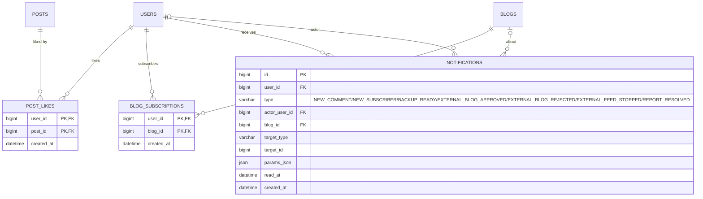

# Data Model: 002 구독과 탐색

> 이 문서는 [001 data-model](../001-blog-core/data-model.md)을 확장한다. DB 공통 규칙(MySQL 8, utf8mb4, 시간은 UTC `DATETIME(6)`, PK `BIGINT AUTO_INCREMENT`, 공통 컬럼 `created_at`·`updated_at`, 개인정보 AES-256-GCM 암호화)과 글 노출 매트릭스는 001을 따른다. 이 스펙의 Flyway 마이그레이션은 아래 새 테이블과 001 테이블 변경을 더한다. 전체 테이블과 관계는 [erd.md](../../erd.md)에 모았다.

## ERD

001 테이블은 관계만 표시했다(속성은 001 data-model). 공통 컬럼(`created_at`·`updated_at`)은 기록 시각 자체가 의미 있는 경우 외에는 생략했다.

## 001 테이블 변경

| 테이블.컬럼 | 타입 | 구분 | 내용 |
|---|---|---|---|
| blogs.subscriber_count | INT | 추가 | INT NOT NULL DEFAULT 0. 비정규화 구독자 수 (FR-031) |
| blogs.feed_item_count | INT | 추가 | INT NOT NULL DEFAULT 20. 피드에 담을 글 수, CHECK IN (10, 20, 30, 50) (FR-046) |
| blogs.feed_content_mode | VARCHAR(10) | 추가 | NOT NULL DEFAULT FULL. FULL(전문) / SUMMARY(요약) (FR-046) |
| posts.like_count | INT | 추가 | INT NOT NULL DEFAULT 0. 비정규화 좋아요 수. 좋아요·취소와 같은 트랜잭션에서 ±1 (FR-030) |

검색용 인덱스(001 posts에서 "002에서 추가"로 둔 것, research R9):
- `posts`: FULLTEXT `ft_posts_title_content (title, content_text) WITH PARSER ngram` — 공개 글의 제목·본문 검색.
- `posts`: FULLTEXT `ft_posts_title (title) WITH PARSER ngram` — 보호 글은 제목만 검색 대상이므로(FR-035, 001 글 노출 매트릭스) 제목 전용 인덱스를 따로 둔다.
- `tags`: FULLTEXT `ft_tags_name (name) WITH PARSER ngram` — 태그 이름 검색.
- 검색 쿼리는 001의 "목록 노출 가능" 조각을 반드시 함께 쓰고, `visibility = PROTECTED`인 글은 `ft_posts_title`로만 맞춘다. ngram token size는 2(MySQL 서버 설정 `ngram_token_size=2`).

## post_likes
좋아요 (FR-030).

| 컬럼 | 타입 | 제약 / 규칙 |
|---|---|---|
| user_id | BIGINT | FK users. 좋아요한 회원 |
| post_id | BIGINT | FK posts. 상세를 볼 수 있는 글에만 누를 수 있다(서비스 검증) |
| created_at | DATETIME(6) | 누른 시각. 003 인기 점수의 최근 7일 좋아요 수 계산에 쓴다 |

- 인덱스: (post_id, created_at) — 글별 좋아요 목록과 003 인기 점수의 최근 7일 좋아요 수.
- 누르기: INSERT + `posts.like_count + 1`, 취소: DELETE + `posts.like_count - 1`(한 트랜잭션). PK 중복이면 이미 누른 것으로 보고 같은 응답을 준다(멱등).
- 글이 영구 삭제되면 함께 지운다. 회원 탈퇴 후에도 행은 남는다(개인정보가 아님, 수치 유지).

## blog_subscriptions
블로그 구독 (FR-031, FR-032).

| 컬럼 | 타입 | 제약 / 규칙 |
|---|---|---|
| user_id | BIGINT | FK users. 구독한 회원. 그 회원이 가진 블로그는 구독할 수 없다(`blogs.user_id <> user_id`, 서비스 검증, FR-031) |
| blog_id | BIGINT | FK blogs. ACTIVE 블로그만 |
| created_at | DATETIME(6) | 구독 시각 |

- 인덱스: (blog_id) — 구독자 수 재계산, 블로그 삭제 시 정리.
- 구독: INSERT + `blogs.subscriber_count + 1`, 취소: DELETE + `- 1`(한 트랜잭션).
- 구독 피드(FR-032)는 `blog_subscriptions JOIN posts`를 "목록 노출 가능" 조건으로 거른 최신순이며 따로 저장하지 않는다. 정지·탈퇴 회원의 블로그 글은 이 조건으로 자동으로 빠진다.
- 004의 차단(blog_blocks)을 만들면 같은 트랜잭션에서 그 회원의 구독 행을 지우고 카운터를 줄인다(004 FR-146). 블로그 삭제(001 FR-159) 후 30일 정리 작업이 그 블로그의 구독 행을 지운다.

## notifications
알림 (FR-033). 회원 단위 하나의 목록이며 내 여러 블로그의 알림이 함께 모인다.

| 컬럼 | 타입 | 제약 / 규칙 |
|---|---|---|
| id | BIGINT | PK |
| user_id | BIGINT | FK users. 받는 회원 |
| type | VARCHAR(30) | 종류(아래 표). 문구는 front가 `type`과 `params_json`으로 받는 회원의 화면 언어로 만든다 |
| actor_user_id | BIGINT | FK users, NULL 가능. 알림을 일으킨 회원(댓글 작성자, 구독자). 비회원·시스템이면 NULL |
| blog_id | BIGINT | FK blogs, NULL 가능. 관련된 내 블로그(내 블로그가 여러 개일 때 어느 블로그의 일인지 표시) |
| target_type | VARCHAR(20) | 관련 대상 종류. COMMENT / BLOG / BLOG_EXPORT / EXTERNAL_BLOG / REPORT |
| target_id | BIGINT | 관련 대상 ID(외래 키 없음, 대상이 지워져도 알림은 남고 링크만 "찾을 수 없음") |
| params_json | JSON | 문구에 넣을 값(글 제목, 거절 사유, 처리 결과, 비회원 이름 등). 사용자 콘텐츠이므로 번역하지 않는다 |
| read_at | DATETIME(6) | 읽은 시각, NULL=안 읽음 |
| created_at | DATETIME(6) | 만든 시각 |

`type` 값(FR-033의 모든 종류):

| type | 정의 스펙 | 언제 | 받는 회원 | target_type / target_id | params_json |
|---|---|---|---|---|---|
| NEW_COMMENT | 002 FR-033 | 내 글에 새 댓글·답글(내가 쓴 것은 제외) | 글이 속한 블로그의 주인 | COMMENT / comments.id | `{ postId, postTitle, guestName? }` |
| NEW_SUBSCRIBER | 002 FR-033 | 내 블로그를 누가 구독 | 블로그 주인 | BLOG / blogs.id | `{ blogTitle }` |
| BACKUP_READY | 004 FR-145 | 백업 파일 준비 완료 | 백업을 요청한 블로그 주인 | BLOG_EXPORT / blog_exports.id | `{ blogTitle, expiresAt }` |
| EXTERNAL_BLOG_APPROVED | 007 FR-111 | 외부 블로그 등록 신청 승인 | 신청 회원 | EXTERNAL_BLOG / external_blogs.id | `{ externalBlogTitle }` |
| EXTERNAL_BLOG_REJECTED | 007 FR-111 | 외부 블로그 등록 신청 거절 | 신청 회원 | EXTERNAL_BLOG / external_blogs.id | `{ externalBlogTitle, reason }` |
| EXTERNAL_FEED_STOPPED | 007 FR-117 | 피드 7일 연속 실패로 자동 중지 | 신청·소유 회원(있을 때) | EXTERNAL_BLOG / external_blogs.id | `{ externalBlogTitle, lastResult }` |
| REPORT_RESOLVED | 005 FR-041 | 내가 한 신고 처리 완료 | 신고한 회원(비회원 권리 침해 신고는 메일) | REPORT / reports.id | `{ result: ACTIONED \| DISMISSED }` |

- 인덱스: (user_id, created_at DESC) 목록, (user_id, read_at) 안 읽은 수.
- 문구는 저장하지 않는다. front가 `notifications.{type}` 메시지 키에 `params_json` 값을 넣어 화면 언어로 보여준다(헌법 원칙 VII). 새 종류를 더하는 스펙은 이 표에 행을 더하고 4개 언어 문구를 같은 PR에 넣는다.
- 같은 이벤트로 알림을 두 번 만들지 않도록 이벤트 처리(트랜잭션 커밋 후)에서 한 번만 만든다. 알림을 일으킨 회원과 받는 회원이 같으면 만들지 않는다.
- 보관: 만든 지 90일(`blog.notifications.retention`, 기본값) 지난 알림은 정리 작업이 지운다. 받는 회원의 개인정보 파기(001 FR-138) 때 그 회원의 알림도 지운다. `actor_user_id`가 탈퇴 회원이면 화면에는 "탈퇴한 회원"으로 보인다.

## 노출 규칙

좋아요 수·구독 피드·검색·RSS·Atom·사이트맵·관련 글(FR-068)의 글 선택은 모두 001 data-model의 "목록 노출 가능"·"본문 노출 가능" 조각과 글 노출 매트릭스를 따르며 이 스펙에서 따로 정하지 않는다. 피드와 사이트맵, 관련 글은 저장 테이블 없이 조회 결과를 캐시한다(research R15, R21).
