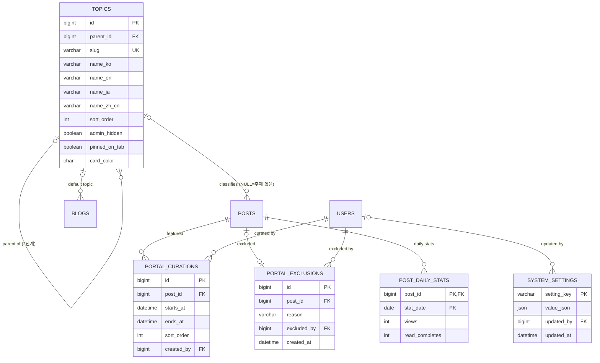

# Data Model: 003 포털

> 이 문서는 [001 data-model](../001-blog-core/data-model.md)을 확장한다. DB 공통 규칙(MySQL 8, utf8mb4, 시간은 UTC `DATETIME(6)`, PK `BIGINT AUTO_INCREMENT`, 공통 컬럼 `created_at`·`updated_at`, 개인정보 AES-256-GCM 암호화)과 글 노출 매트릭스는 001을 따른다. 이 스펙의 Flyway 마이그레이션은 아래 새 테이블과 001 테이블 변경을 더한다. 전체 테이블과 관계는 [erd.md](../../erd.md)에 모았다.

## ERD

001 테이블은 관계만 표시했다(속성은 001 data-model). 공통 컬럼(`created_at`·`updated_at`)은 기록 시각 자체가 의미 있는 경우 외에는 생략했다. 릴리스 노트 테이블(release_notes 등)은 관리자가 만드는 쪽인 [006 data-model](../006-admin-consoles/data-model.md)에 있고, 이 스펙은 읽기만 한다(아래 "릴리스 노트 읽기").

## 001 테이블 변경

| 테이블.컬럼 | 타입 | 구분 | 내용 |
|---|---|---|---|
| users.last_seen_release_version | VARCHAR(20) | 추가 | NULL=확인한 적 없음. 회원이 마지막으로 확인한 릴리스 노트 버전(`1.2.0` 형식). SemVer 숫자 비교로 더 높은 값으로만 바꾼다. 외래 키 없음(값 참조) (FR-163) |
| blogs.portal_enabled | BOOLEAN | 추가 | NOT NULL DEFAULT true. "포털에 내 글 노출" (FR-089) |
| blogs.default_topic_id | BIGINT | 추가 | FK topics, NULL 가능. 블로그 기본 주제(소분류만), 새 글 작성 시 미리 선택 (FR-077) |
| blogs.first_published_at | DATETIME(6) | 추가 | NULL 가능. 이 블로그에서 처음 글을 발행한 시각(처음 한 번만 설정). 인덱스. "새로 시작한 블로그"(FR-087) |
| posts.topic_id | BIGINT | 추가 | FK topics, NULL=주제 없음. 소분류만 가리킨다(서비스 검증). 인덱스 (topic_id, status, visibility, published_at DESC) (FR-076) |
| post_drafts.topic_id | BIGINT | 추가 | 작성 중 사본의 주제(소분류). category_id처럼 외래 키 없이 두고 발행 때 검증해 posts.topic_id에 반영 (FR-076) |

- 글의 주제(`posts.topic_id`)는 발행 설정(PublishSettings)과 작성 중 사본에 함께 저장되며, 소분류(`parent_id IS NOT NULL`)이고 운영자 숨김이 아닌 주제만 고를 수 있다. 이미 고른 주제가 나중에 숨겨져도 글의 값은 그대로 두고 주제 페이지에만 나오지 않는다.
- `blogs.first_published_at`은 글 발행 트랜잭션에서 `NULL`일 때만 채운다. 삭제한 글이 있어도 되돌리지 않는다.

## topics
서비스 주제 (FR-075, FR-079, FR-147).

| 컬럼 | 타입 | 제약 / 규칙 |
|---|---|---|
| id | BIGINT | PK |
| parent_id | BIGINT | FK topics, NULL=대분류. 값이 있으면 소분류이며 부모의 parent_id는 NULL이어야 한다(2단계, 서비스 검증) |
| slug | VARCHAR(40) | UNIQUE(서비스 전체), 주소용 영문 식별자 `^[a-z0-9]+(-[a-z0-9]+)*$` 2~40자. 만든 뒤 바꿀 수 없음 (FR-075, FR-079) |
| name_ko | VARCHAR(50) | NOT NULL. 한국어 이름 (FR-079, 001 FR-151) |
| name_en | VARCHAR(50) | NOT NULL. 영어 이름 |
| name_ja | VARCHAR(50) | NOT NULL. 일본어 이름 |
| name_zh_cn | VARCHAR(50) | NOT NULL. 중국어(간체) 이름 |
| sort_order | INT | 같은 부모 안의 순서 |
| admin_hidden | BOOLEAN | NOT NULL DEFAULT false. 운영자 숨김(FR-079). 대분류가 숨김이면 소분류도 숨김으로 본다(저장값은 그대로) |
| pinned_on_tab | BOOLEAN | NOT NULL DEFAULT false. 운영자가 주제 탭에 열어 둔 주제. true면 자동 숨김(FR-147) 기준과 관계없이 탭에 나온다 |
| card_color | CHAR(7) | NULL 가능. 대표 이미지가 없는 글 카드의 기본 이미지 색(`#RRGGBB`). 소분류가 NULL이면 대분류 색 |

- 인덱스: (parent_id, sort_order).
- 삭제하지 않고 숨긴다(FR-079). 초기 목록(FR-075 표)은 Flyway 데이터 마이그레이션으로 넣으며, 4개 언어 이름을 모두 채워야 한다.
- **운영자 숨김 vs 자동 숨김**: 운영자 숨김은 `admin_hidden`(저장값)이며 작성 화면·주제 탭·주제 페이지 모두에서 빠진다(주제 페이지 404). 자동 숨김(FR-147)은 저장하지 않는다. 최근 30일 포털 노출 글 수(내부 글 + 007 외부 글)를 주제별로 세어 기준(`portal.topic-auto-hide-threshold`) 미만이고 `pinned_on_tab = false`이면 주제 탭에서만 뺀다. 이 계산은 포털 목록과 같은 5분 캐시로 한다(FR-090).
- 대분류의 글 수는 소속 소분류 글 수의 합이다. 대분류 페이지는 소속 소분류의 글을 모두 보여준다(FR-078).

## portal_curations
운영자 추천 (FR-091, FR-092).

| 컬럼 | 타입 | 제약 / 규칙 |
|---|---|---|
| id | BIGINT | PK |
| post_id | BIGINT | FK posts. 지정할 때 포털 노출 조건(FR-088)을 만족해야 한다 |
| starts_at | DATETIME(6) | 노출 시작 |
| ends_at | DATETIME(6) | 노출 종료, CHECK (ends_at > starts_at) |
| sort_order | INT | 추천 영역 안의 순서 |
| created_by | BIGINT | FK users. 지정한 관리자 |

- 인덱스: (starts_at, ends_at).
- 같은 시각에 노출되는 추천은 최대 5편: 저장할 때 기간이 겹치는 행 수를 세어 검증한다(서비스).
- 추천 영역은 "지금 기간 안 AND 글이 포털 노출 조건(FR-088)을 만족"인 행만 `sort_order` 순으로 보여준다. 조건을 잃은 글의 행은 지우지 않고 화면에서만 빠진다(FR-092). 지난 행은 이력으로 남긴다.
- 만들기·수정·삭제는 006 FR-106 작업 기록에 남는다.

## portal_exclusions
포털 제외 (FR-093). 007에서 외부 글도 같은 테이블로 제외한다.

| 컬럼 | 타입 | 제약 / 규칙 |
|---|---|---|
| id | BIGINT | PK |
| post_id | BIGINT | FK posts, UNIQUE. 제외된 글 (007에서 NULL 허용으로 바뀜) |
| reason | VARCHAR(500) | NOT NULL. 제외 사유 (FR-093) |
| excluded_by | BIGINT | FK users. 처리한 관리자 |
| created_at | DATETIME(6) | 제외 시각 |

- 제외 해제는 행을 지운다(이력은 006 작업 기록). 블로그·검색·RSS 노출에는 영향이 없다.

## post_daily_stats
글별 일별 신호 (FR-086). 001 research R10의 일별 집계이며, 좋아요·댓글 수는 `post_likes.created_at`·`comments.created_at`으로 세므로 여기 두지 않는다.

| 컬럼 | 타입 | 제약 / 규칙 |
|---|---|---|
| post_id | BIGINT | FK posts |
| stat_date | DATE | UTC 날짜 |
| views | INT | NOT NULL DEFAULT 0. 그날 늘어난 조회수(001 FR-020의 중복 제거를 거친 값, posts.view_count와 같은 시점에 증가) |
| read_completes | INT | NOT NULL DEFAULT 0. 본문 끝까지 읽음 수(같은 방문자 30분 중복 제거) (FR-086) |

- 조회수 증가(001 `POST /posts/{id}/views`)와 같은 트랜잭션에서 upsert(`INSERT ... ON DUPLICATE KEY UPDATE views = views + 1`). 끝까지 읽음은 front가 본문 끝에 도달했을 때 보내는 이벤트로 올린다(API는 003 contracts에서 정함).
- 보관: 90일 지난 행은 정리 작업이 지운다(인기 점수는 최근 7일만 씀).

## system_settings
운영자가 시스템 관리자 콘솔에서 바꾸는 설정값 (FR-086, FR-088, FR-147, 006 FR-102). 값이 없으면 같은 의미의 backend 프로퍼티(`blog.portal.*` 등)가 기본값이다. 005와 007이 키를 더한다.

| 컬럼 | 타입 | 제약 / 규칙 |
|---|---|---|
| setting_key | VARCHAR(100) | PK. 설정 키(아래 표) |
| value_json | JSON | NOT NULL. 값. 행이 없으면 같은 이름의 backend 프로퍼티 기본값을 쓴다 |
| updated_by | BIGINT | FK users. 마지막으로 바꾼 관리자 |
| updated_at | DATETIME(6) | 바꾼 시각 |

| setting_key | 정의 스펙 | 값 예 | 설명 |
|---|---|---|---|
| portal.score-weights | 003 FR-086 | `{ "view": 1, "readComplete": 5, "like": 10, "comment": 8, "halfLifeHours": 48, "reportPenalty": 0.5 }` | 내부 글 인기 점수 가중치(구체 값은 003 plan) |
| portal.new-member-delay | 003 FR-088 | `"PT24H"` | 가입 후 포털 노출까지 대기 |
| portal.min-content-length | 003 FR-088 | `200` | 포털 노출 최소 본문 길이(content_text 글자 수) |
| portal.topic-auto-hide-threshold | 003 FR-147 | `20` | 주제 자동 숨김 기준(최근 30일 글 수) |
| ratelimit.* | 005 FR-142 | `{ "postPublishPerHour": 10, ... }` | 작성 속도 한도([005 data-model](../005-trackback-moderation/data-model.md)) |
| external.* | 007 FR-113·118·124 | `"PT30M"`, `0.7`, `1.0` | 수집 주기, 자동 분류 신뢰도 기준, 외부 글 점수 가중치([007 data-model](../007-external-feeds/data-model.md)) |

- 값은 키마다 정해진 형식으로 검증한다(알 수 없는 키 거부). 바꾸면 006 FR-106 작업 기록(`SETTING_CHANGE`, `target_key` = 키)에 전후 값이 남는다. backend는 값을 메모리에 캐시하고 바꿀 때 무효화한다.

## 포털 노출 계산 (저장 테이블 없음)

- 포털 노출 조건(FR-088): 001 "본문 노출 가능" AND `blogs.portal_enabled` AND 포털 제외 행 없음 AND `users.created_at <= now - portal.new-member-delay` AND `CHAR_LENGTH(posts.content_text) >= portal.min-content-length`. 하나의 쿼리 조각으로만 표현한다(001 노출 조각과 같은 방식).
- 인기 점수(FR-086)는 post_daily_stats(최근 7일)·post_likes·comments·reports(005, `target_blog_id`가 같은 ACTIONED 신고가 있는 블로그 감점)로 계산해 5분 캐시한다(research R10). 점수 자체는 저장하지 않는다. 외부 글 점수는 007 data-model.
- 인기 태그(FR-087)는 최근 7일 발행된 포털 노출 글의 post_tags로 센다.

## 릴리스 노트 읽기 (FR-161~166)

- 테이블: `release_notes`, `release_note_contents`, `release_note_revisions`([006 data-model](../006-admin-consoles/data-model.md)). 이 스펙은 `status = PUBLISHED`인 행만 읽는다.
- 언어판 고르기: 요청 언어 → en → ko 순으로 `release_note_contents`에서 첫 번째로 있는 행(FR-161).
- 포털 카드(FR-162): 버전이 가장 높은 PUBLISHED 노트의 `first_published_at >= now - blog.release-notes.portal-card-days`(기본 14일)이면 보여준다.
- 배너(FR-163): 버전이 가장 높은 PUBLISHED 노트가 `users.last_seen_release_version`보다 높고(NULL이면 무조건 높음), 그 노트의 `first_published_at > users.created_at`이면 배너를 보여준다. 버전 비교는 문자열이 아니라 (major, minor, patch) 숫자 비교다. 닫기·열기는 `last_seen_release_version`을 더 높은 값으로만 바꾼다(`UPDATE ... WHERE` 조건으로 낮아지지 않게).
- 검색(FR-165)·수정 이력(FR-166)은 006 data-model의 "읽기 쿼리"를 따른다.
