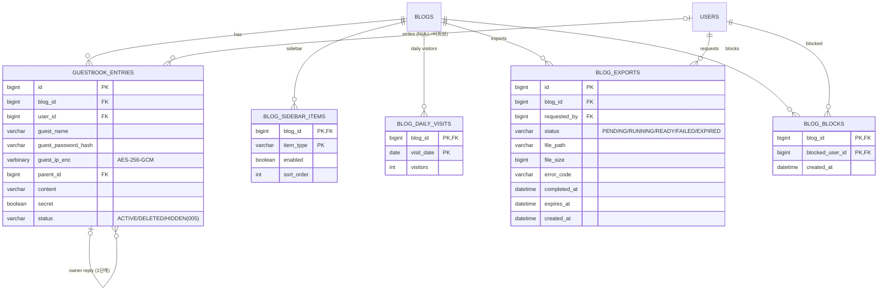

# Data Model: 004 블로그 꾸미기와 글 옵션

> 이 문서는 [001 data-model](../001-blog-core/data-model.md)을 확장한다. DB 공통 규칙(MySQL 8, utf8mb4, 시간은 UTC `DATETIME(6)`, PK `BIGINT AUTO_INCREMENT`, 공통 컬럼 `created_at`·`updated_at`, 개인정보 AES-256-GCM 암호화)과 글 노출 매트릭스(이미 PROTECTED·SCHEDULED 행이 있음)는 001을 따른다. 이 스펙은 아래 새 테이블과 001 테이블 변경을 Crowfoot 문서에 더한다([db/README.md](../../db/README.md)). 전체 테이블과 관계는 [erd.md](../../erd.md)에 모았다.

## ERD

001 테이블은 관계만 표시했다(속성은 001 data-model). 공통 컬럼(`created_at`·`updated_at`)은 기록 시각 자체가 의미 있는 경우 외에는 생략했다. comments·posts·blogs에 더하는 컬럼은 아래 "001 테이블 변경"에 있다.

## 001 테이블 변경

| 테이블.컬럼 | 타입 | 구분 | 내용 |
|---|---|---|---|
| blogs.guestbook_enabled | BOOLEAN | 추가 | NOT NULL DEFAULT true. 방명록 켜기·끄기 (FR-058) |
| blogs.guest_write_enabled | BOOLEAN | 추가 | NOT NULL DEFAULT false. 비회원 댓글·방명록 허용 (FR-066) |
| blogs.total_visitors | BIGINT | 추가 | NOT NULL DEFAULT 0. 전체 방문자 수(방문 기록 때 blog_daily_visits와 함께 +1, research R19) (FR-067) |
| posts.password_hash | VARCHAR(100) | 추가 | 보호 글 비밀번호 BCrypt. CHECK ((visibility = 'PROTECTED') = (password_hash IS NOT NULL)). 공개 범위를 PROTECTED에서 바꾸면 NULL로 지운다 (FR-062) |
| posts.scheduled_at | DATETIME(6) | 추가 | 예약 발행 시각. SCHEDULED이면 필수(서비스 검증. 휴지통·숨김에서 SCHEDULED로 되돌릴 때 값을 쓰므로 DB CHECK는 두지 않음). 인덱스 (status, scheduled_at) (FR-064, research R17) |
| posts.notice | BOOLEAN | 추가 | NOT NULL DEFAULT false. 공지 글. 블로그 홈 목록 위에 따로 보이고 일반 목록에서는 빠진다. 인덱스 (blog_id, notice, published_at DESC) (FR-059) |
| posts.visibility | VARCHAR(10) | 변경 | PROTECTED(보호 글) 값 추가 → PUBLIC / PRIVATE / PROTECTED (FR-062) |
| posts.status | VARCHAR(10) | 변경 | SCHEDULED(예약) 값 추가 (FR-064) |
| comments.guest_name | VARCHAR(30) | 추가 | 비회원 이름. CHECK ((user_id IS NOT NULL AND guest_name IS NULL) OR (user_id IS NULL AND guest_name IS NOT NULL AND guest_password_hash IS NOT NULL)) |
| comments.guest_password_hash | VARCHAR(100) | 추가 | 비회원 비밀번호 BCrypt. 같은 비밀번호로만 수정·삭제 (FR-066) |
| comments.guest_ip_enc | VARBINARY(128) | 추가 | 비회원 작성 IP, AES-256-GCM 암호문 (001 FR-134). 90일 뒤 NULL로 지움 |
| comments.secret | BOOLEAN | 추가 | NOT NULL DEFAULT false. 비밀 댓글: 글 주인과 작성자만 내용을 본다 (FR-065, research R20) |
| comments.user_id | BIGINT | 변경 | NULL 허용으로 변경(NULL=비회원 댓글, FR-066) |

### 보호 글 (FR-062, FR-063, research R18)
- `visibility = PROTECTED`이면 `password_hash`가 반드시 있다. 비밀번호는 발행 설정(PublishSettings)에서 받아 BCrypt로 저장하며 응답에 내보내지 않는다.
- 본문 열람 허용은 저장하지 않는다. 비밀번호가 맞으면 글 ID를 담은 서명된 단기 쿠키(30분)를 준다. 5회 연속 실패 10분 차단은 (postId, 방문자 키) Caffeine 카운터로 하며 테이블이 없다.
- 노출은 001 글 노출 매트릭스의 PROTECTED 행(목록·피드·검색은 제목만, 포털·사이트맵 제외)을 따른다.

### 예약 발행 (FR-064, research R17)
- 상태 전이(001의 전이에 더함): DRAFT → SCHEDULED(발행 설정에서 미래 시각 선택, `scheduled_at` 설정), SCHEDULED → PUBLISHED(정기 작업이 `scheduled_at <= now`인 글을 바꾸고 `published_at = scheduled_at`이 아니라 실제 발행 시각 now로 설정), SCHEDULED → DRAFT(예약 취소, `scheduled_at` NULL), SCHEDULED → DELETED(휴지통, `status_before_delete = SCHEDULED`, 복구하면 SCHEDULED로 돌아오고 시각이 지났으면 다음 작업 주기에 바로 발행).
- 과거 시각을 고르면 예약하지 않고 바로 PUBLISHED로 발행한다(Edge Cases). 이미 발행된 글(PUBLISHED)은 예약 상태로 되돌리지 않는다(수정 발행은 즉시).
- 예약 글은 주인 외에게 404이며 어떤 목록에도 나오지 않는다(001 글 노출 매트릭스의 SCHEDULED 행).

### 공지 (FR-059)
- `notice = true`인 글은 블로그 홈 목록 위의 공지 영역과 공지 목록(`/:handle/notice`)에만 나오고 일반 목록에서는 빠진다. 공지 여부와 관계없이 001 글 노출 매트릭스를 그대로 따른다(비공개 공지는 주인에게만).

### 비회원 댓글과 비밀 댓글 (FR-065, FR-066, research R20)
- 비회원 댓글은 `user_id` NULL, `guest_name`·`guest_password_hash` 필수, `guest_ip_enc`는 AES-256-GCM(001 개인정보 암호화 규칙). 비회원 글 IP는 작성 후 90일이 지나면 개인정보 파기 작업(`blog.jobs.privacy-purge-cron`)이 NULL로 지운다.
- 비밀 댓글(`secret = true`)은 글 주인과 작성자(회원은 user_id, 비회원은 비밀번호 확인)에게만 `content`를 주고 그 외에는 `content = null`로 내려보낸다(서비스 계층 한 곳에서 거름).
- 비회원 쓰기는 블로그의 `guest_write_enabled = true`일 때만 허용하며 CAPTCHA(005 FR-141)를 거친다.

## guestbook_entries
방명록 글 (FR-056~058, FR-066).

| 컬럼 | 타입 | 제약 / 규칙 |
|---|---|---|
| id | BIGINT | PK |
| blog_id | BIGINT | FK blogs |
| user_id | BIGINT | FK users, NULL=비회원 |
| guest_name | VARCHAR(30) | 비회원 이름. 비회원이면 필수, 회원이면 NULL (FR-066) |
| guest_password_hash | VARCHAR(100) | 비회원 비밀번호 BCrypt. 비회원이면 필수 |
| guest_ip_enc | VARBINARY(128) | 비회원 작성 IP, AES-256-GCM 암호문 (001 FR-134). 90일 뒤 NULL로 지움 |
| parent_id | BIGINT | FK guestbook_entries, NULL=방명록 글, 값=블로그 주인의 답글. 부모의 parent_id는 NULL이어야 함(1단계) |
| content | VARCHAR(1000) | 일반 텍스트(출력 시 이스케이프) |
| secret | BOOLEAN | NOT NULL DEFAULT false. 비밀글: 블로그 주인과 작성자만 내용을 본다 (FR-057) |
| status | VARCHAR(10) | ACTIVE / DELETED (005에서 HIDDEN 추가) |

- 인덱스: (blog_id, status, created_at DESC) 목록, (parent_id) 답글.
- 답글(`parent_id` 값)은 블로그 주인만 쓴다. 답글이 있는 글을 지우면 댓글처럼 "삭제된 글입니다"로 자리만 남긴다.
- 비밀글의 내용은 블로그 주인과 작성자에게만 준다. 비밀글에 단 주인 답글도 같은 사람에게만 보인다.
- 방명록이 꺼진 블로그(`blogs.guestbook_enabled = false`)는 행을 지우지 않고 화면·API만 막는다.
- 비회원 IP(`guest_ip_enc`)와 비밀번호 규칙은 위 비회원 댓글과 같다. 차단된 회원(blog_blocks)은 쓸 수 없다(FR-146).

## blog_sidebar_items
블로그 사이드바 (FR-060).

| 컬럼 | 타입 | 제약 / 규칙 |
|---|---|---|
| blog_id | BIGINT | FK blogs |
| item_type | VARCHAR(20) | PROFILE / CATEGORIES / RECENT_POSTS / RECENT_COMMENTS / POPULAR_POSTS / TAGS / ARCHIVE / VISITORS / SEARCH / FEED_LINKS (FR-060) |
| enabled | BOOLEAN | NOT NULL. 켜짐 여부 |
| sort_order | INT | NOT NULL. 사이드바 안의 순서 |

- 블로그에 행이 하나도 없으면 기본 구성(PROFILE, CATEGORIES, RECENT_POSTS, TAGS, ARCHIVE, SEARCH, FEED_LINKS 켜짐, 나머지 꺼짐, 이 순서)으로 보여준다. 저장할 때는 10개 항목을 모두 한 번에 바꾼다(전체 교체).
- 사이드바 항목의 내용(최근 글·인기 글 등)도 001 글 노출 매트릭스를 따른다.

## blog_daily_visits
일별 방문자 수 (FR-067, research R19).

| 컬럼 | 타입 | 제약 / 규칙 |
|---|---|---|
| blog_id | BIGINT | FK blogs |
| visit_date | DATE | 방문 날짜. `blog.stats.time-zone`(기본 Asia/Seoul) 기준 날짜 |
| visitors | INT | NOT NULL DEFAULT 0. 그날 방문자 수(같은 방문자 하루 1회, FR-067) |

- 방문 기록 API가 (blogId, 방문자 키, 날짜) Caffeine 캐시로 하루 한 번만 통과시킨 뒤 `INSERT ... ON DUPLICATE KEY UPDATE visitors = visitors + 1`과 `blogs.total_visitors + 1`을 한 트랜잭션에서 한다. 방문자 키는 회원 ID 또는 익명 방문자 쿠키이며 저장하지 않는다(개인정보 없음). 봇은 세지 않는다.
- 오늘·어제는 `blog.stats.time-zone` 날짜 기준이다. 통계 화면은 최근 30일만 쓰며, 보관 기간은 004 plan에서 정한다.

## blog_exports
블로그 백업 (FR-145).

| 컬럼 | 타입 | 제약 / 규칙 |
|---|---|---|
| id | BIGINT | PK |
| blog_id | BIGINT | FK blogs |
| requested_by | BIGINT | FK users. 요청한 블로그 주인 |
| status | VARCHAR(10) | PENDING(대기) / RUNNING(만드는 중) / READY(완료) / FAILED(실패) / EXPIRED(만료, 파일 삭제됨) |
| file_path | VARCHAR(300) | `blog.export.dir` 기준 상대 경로, 무작위 파일 이름. READY일 때만 값 |
| file_size | BIGINT | 바이트 |
| error_code | VARCHAR(50) | FAILED일 때 원인 코드 |
| completed_at | DATETIME(6) | READY가 된 시각 |
| expires_at | DATETIME(6) | completed_at + 7일 (FR-145) |
| created_at | DATETIME(6) | 요청 시각 |

- 인덱스: (blog_id, created_at DESC), (status, expires_at).
- 하루 1회: 같은 블로그에 최근 24시간 안에 만든 행 중 FAILED가 아닌 것이 있으면 거부한다.
- PENDING → RUNNING → READY(알림 BACKUP_READY, 002 notifications) 또는 FAILED. READY는 `expires_at`이 지나면 정리 작업이 파일을 지우고 EXPIRED로 바꾼다. 파일 내려받기는 블로그 주인만, `file_path`는 응답에 내보내지 않는다.
- 파일은 `blog.export.dir`(백업 전용 디렉터리 프로퍼티)에 둔다. 블로그 삭제(001 FR-159) 후 30일 정리 때 그 블로그의 백업 행과 파일도 지운다.

## blog_blocks
블로그별 회원 차단 (FR-146).

| 컬럼 | 타입 | 제약 / 규칙 |
|---|---|---|
| blog_id | BIGINT | FK blogs |
| blocked_user_id | BIGINT | FK users. 차단된 회원(블로그 주인 자신은 안 됨) |
| created_at | DATETIME(6) | 차단 시각 |

- 인덱스: (blocked_user_id) — 쓰기 요청마다 "이 회원이 이 블로그에서 차단되었나" 확인.
- 차단을 만들 때 같은 트랜잭션에서 그 회원의 이 블로그 구독(002 blog_subscriptions)을 지우고 `blogs.subscriber_count`를 줄인다. 차단된 회원은 이 블로그의 댓글·방명록 쓰기와 구독이 거부되며, 차단 사실은 알리지 않는다(일반 거부 응답).
- 비회원은 차단 대상이 아니다(비회원 쓰기는 `guest_write_enabled`와 005의 속도 제한·금칙어로 막는다).
