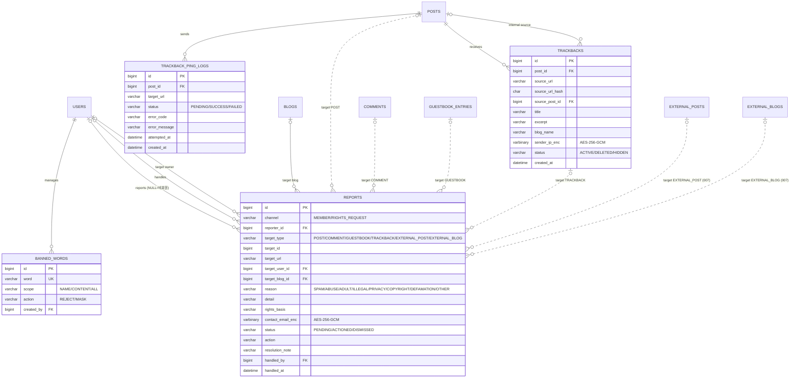

# Data Model: 005 트랙백과 운영

> 이 문서는 [001 data-model](../001-blog-core/data-model.md)을 확장한다. DB 공통 규칙(MySQL 8, utf8mb4, 시간은 UTC `DATETIME(6)`, PK `BIGINT AUTO_INCREMENT`, 공통 컬럼 `created_at`·`updated_at`, 개인정보 AES-256-GCM 암호화)과 글 노출 매트릭스(이미 HIDDEN 행이 있음)는 001을 따른다. 이 스펙은 아래 새 테이블과 001·004 테이블 변경을 Crowfoot 문서에 더한다([db/README.md](../../db/README.md)). 전체 테이블과 관계는 [erd.md](../../erd.md)에 모았다.

## ERD

001·004·007 테이블은 관계만 표시했다. 점선은 외래 키가 없는 다형 참조(`reports.target_type` + `target_id`)다. 공통 컬럼(`created_at`·`updated_at`)은 기록 시각 자체가 의미 있는 경우 외에는 생략했다.

## 기존 테이블 변경 (001, 004)

| 테이블.컬럼 | 타입 | 구분 | 내용 |
|---|---|---|---|
| blogs.trackback_enabled | BOOLEAN | 추가 | NOT NULL DEFAULT true. 트랙백 받기 (FR-053) |
| posts.status_before_hidden | VARCHAR(10) | 추가 | 숨김 직전 status. 관리자가 숨김을 풀면 이 값으로 되돌림 (FR-041) |
| posts.status | VARCHAR(10) | 변경 | HIDDEN(관리자 숨김) 값 추가 (FR-041) |
| comments.status | VARCHAR(10) | 변경 | HIDDEN 값 추가. 숨김 해제는 ACTIVE로 (FR-041) |
| guestbook_entries.status | VARCHAR(10) | 변경 | HIDDEN 값 추가. 숨김 해제는 ACTIVE로 (FR-041) |

### 숨김 (FR-041)
- 관리자가 글을 숨기면 `status_before_hidden = status`, `status = HIDDEN`. 숨김을 풀면 `status = status_before_hidden`, `status_before_hidden = NULL`. DELETED 글은 숨기지 않는다(이미 노출 없음).
- 숨긴 글은 001 글 노출 매트릭스의 HIDDEN 행을 따른다(주인에게는 숨김 안내와 함께 보임). 주인이 숨긴 글을 휴지통으로 보내면 `status_before_delete = HIDDEN`이 되어 복구해도 숨김 상태로 돌아온다. 숨김 동안 주인이 발행·공개 범위를 바꾸는 것은 막는다.
- 댓글·방명록 글·트랙백은 ACTIVE ↔ HIDDEN만 오가며 따로 이전 상태를 두지 않는다. HIDDEN은 작성자와 관리자 외에게 보이지 않는다.
- 숨김·해제는 006 FR-106 작업 기록(`CONTENT_HIDE`, `CONTENT_UNHIDE`)에 남는다.

### 정지 (FR-042)
- 001 `users.status = SUSPENDED`를 그대로 쓴다(새 컬럼 없음). 정지 사유와 처리자는 006 작업 기록에 남는다.

## reports
신고 (FR-040, FR-041). 회원 신고와 비회원 권리 침해 신고를 한 테이블에 둔다.

| 컬럼 | 타입 | 제약 / 규칙 |
|---|---|---|
| id | BIGINT | PK |
| channel | VARCHAR(15) | MEMBER(회원 신고 버튼) / RIGHTS_REQUEST(권리 침해 신고 양식) (FR-040) |
| reporter_id | BIGINT | FK users. MEMBER면 필수, RIGHTS_REQUEST면 NULL. CHECK ((channel = 'MEMBER') = (reporter_id IS NOT NULL)) |
| target_type | VARCHAR(20) | POST / COMMENT / GUESTBOOK / TRACKBACK / EXTERNAL_POST / EXTERNAL_BLOG. MEMBER면 필수, RIGHTS_REQUEST는 target_url을 해석할 수 있을 때 서비스가, 아니면 관리자가 채운다 |
| target_id | BIGINT | 대상 ID. 대상 종류에 따라 posts / comments / guestbook_entries / trackbacks / external_posts / external_blogs의 id(다형 참조라 외래 키 없음) |
| target_url | VARCHAR(1000) | 권리 침해 양식의 대상 주소(RIGHTS_REQUEST 필수) |
| target_user_id | BIGINT | FK users, NULL 가능. 접수 시점의 대상 작성자(내부 콘텐츠) 또는 외부 블로그의 신청·소유 회원. 006 FR-104 "받은 신고 수" |
| target_blog_id | BIGINT | FK blogs, NULL 가능. 내부 콘텐츠가 속한 블로그. 003 FR-086의 블로그 점수 감점 계산 |
| reason | VARCHAR(20) | SPAM / ABUSE(욕설·혐오) / ADULT / ILLEGAL / PRIVACY(개인정보 노출) / COPYRIGHT / DEFAMATION(명예훼손) / OTHER |
| detail | VARCHAR(1000) | 신고자 설명(선택, OTHER면 필수) |
| rights_basis | VARCHAR(2000) | 권리 근거(RIGHTS_REQUEST 필수) |
| contact_email_enc | VARBINARY(512) | 비회원 연락 이메일, AES-256-GCM 암호문(RIGHTS_REQUEST 필수, 001 FR-134). 처리 후 보존 기간이 지나면 NULL로 파기 |
| status | VARCHAR(10) | PENDING(대기) / ACTIONED(조치) / DISMISSED(기각) |
| action | VARCHAR(25) | ACTIONED일 때 조치: HIDE_CONTENT / REMOVE_FROM_PORTAL / BLOCK_EXTERNAL_BLOG / SUSPEND_USER |
| resolution_note | VARCHAR(1000) | 관리자 메모(신고자에게 보이지 않음) |
| handled_by | BIGINT | FK users, NULL 가능. 처리한 관리자 |
| handled_at | DATETIME(6) | 처리 시각 |

- 인덱스: (status, created_at) 신고 목록, (target_type, target_id) 같은 대상 묶기, (target_user_id) 회원 상세의 받은 신고 수, (target_blog_id, status) 포털 점수 감점.
- UNIQUE (reporter_id, target_type, target_id): 한 회원은 같은 대상을 한 번만 신고한다(비회원 신고는 reporter_id가 NULL이라 제한 없음, 대신 CAPTCHA FR-141).
- 처리: 관리자가 한 대상에 조치하거나 기각하면 그 대상의 PENDING 신고를 모두 같은 결과로 닫고, 회원 신고자마다 REPORT_RESOLVED 알림(002 notifications)을 만든다. 비회원 신고자에게는 `contact_email_enc`를 복호화해 처리 결과 메일을 보낸다.
- 대상별 조치: POST·COMMENT·GUESTBOOK·TRACKBACK은 HIDDEN(위), EXTERNAL_POST는 포털에서 내림(007 `external_posts.status = REMOVED`, `removed_reason = REPORT`), EXTERNAL_BLOG는 차단(007 `external_blogs.status = BLOCKED`) (FR-041, 007 FR-127).
- **개인정보**: `contact_email_enc`는 001 개인정보 암호화 규칙(AES-256-GCM, 키 버전, `blog.crypto.*`)을 따른다. 검색할 일이 없으므로 해시 컬럼은 두지 않는다. 처리 후 `blog.privacy.rights-request-retention`(기본 1년)이 지나면 개인정보 파기 작업이 NULL로 지운다. 회원 신고에는 연락처를 받지 않는다.

## trackbacks
받은 트랙백 (FR-049~051, FR-053~055, research R16).

| 컬럼 | 타입 | 제약 / 규칙 |
|---|---|---|
| id | BIGINT | PK |
| post_id | BIGINT | FK posts. 트랙백을 받은 글 |
| source_url | VARCHAR(1000) | NOT NULL. 보낸 글 주소(http/https) |
| source_url_hash | CHAR(64) | SHA-256(정규화한 source_url). UNIQUE(post_id, source_url_hash): 같은 글에 같은 주소는 하나만 (FR-054) |
| source_post_id | BIGINT | FK posts, NULL 가능. 서비스 안의 글이 보낸 트랙백이면 그 글. 그 글이 "본문 노출 가능"이 아니게 되면 이 트랙백을 보여주지 않는다 |
| title | VARCHAR(255) | 태그 제거 일반 텍스트 |
| excerpt | VARCHAR(255) | 요약, 태그 제거 일반 텍스트 최대 255자 (FR-051) |
| blog_name | VARCHAR(255) | 보낸 블로그 이름 |
| sender_ip_enc | VARBINARY(128) | 보낸 곳 IP, AES-256-GCM 암호문(비회원 작성 IP와 같게 취급, 001 FR-134). 90일 뒤 NULL로 지움 |
| status | VARCHAR(10) | ACTIVE / DELETED(글 주인 삭제) / HIDDEN(관리자 숨김) |
| created_at | DATETIME(6) | 받은 시각 |

- 인덱스: (post_id, status, created_at DESC) 글 상세 목록.
- 받기 전에 대상 글이 "본문 노출 가능"이고 `blogs.trackback_enabled = true`인지 확인한다(FR-055, 보호 글도 거부). 같은 출처 IP 10분 10회 제한은 Caffeine 카운터(테이블 없음).
- 글 주인이 지우면 `DELETED`로 두고 행을 남긴다. 그래서 같은 주소에서 다시 핑이 와도 UNIQUE에 걸려 쌓이지 않는다(스팸 방지). 글이 영구 삭제되면 함께 지운다.
- 서비스 안의 글이 보낸 트랙백(`source_post_id`)은 보낸 글이 비공개·삭제 등으로 "본문 노출 가능"이 아니게 되면 목록에서 빠진다(001 글 노출 매트릭스, SC-004).

## trackback_ping_logs
보낸 트랙백 기록 (FR-052, research R16).

| 컬럼 | 타입 | 제약 / 규칙 |
|---|---|---|
| id | BIGINT | PK |
| post_id | BIGINT | FK posts. 트랙백을 보낸 글 |
| target_url | VARCHAR(1000) | 보낼 트랙백 주소 |
| status | VARCHAR(10) | PENDING / SUCCESS / FAILED |
| error_code | VARCHAR(30) | FAILED 이유: INVALID_URL / BLOCKED_ADDRESS / TIMEOUT / HTTP_ERROR / REMOTE_ERROR |
| error_message | VARCHAR(255) | 상대가 돌려준 `<message>`(일반 텍스트) |
| attempted_at | DATETIME(6) | 보낸 시각 |
| created_at | DATETIME(6) | 요청(발행·수정) 시각 |

- 인덱스: (post_id, created_at DESC). 발행·수정 후 비동기로 보내고 결과를 갱신한다. 글이 영구 삭제되면 함께 지운다.

## banned_words
금칙어 (FR-143).

| 컬럼 | 타입 | 제약 / 규칙 |
|---|---|---|
| id | BIGINT | PK |
| word | VARCHAR(50) | UNIQUE. 정규화(NFKC, 앞뒤 공백 제거, 소문자) 값 |
| scope | VARCHAR(10) | NAME(닉네임·블로그 주소·블로그 제목) / CONTENT(댓글·방명록) / ALL |
| action | VARCHAR(10) | REJECT(저장 거부) / MASK(가림). NAME 적용에는 항상 REJECT (FR-143) |
| created_by | BIGINT | FK users. 등록한 관리자 |

- 이름류(닉네임·블로그 주소·블로그 제목)는 포함되면 저장 거부, 본문류(댓글·방명록)는 `action`대로 거부하거나 가림(`*`) 처리한다. 비교는 같은 정규화를 거친 부분 문자열 일치다.
- 목록은 메모리에 캐시하고 바꿀 때 무효화한다. 추가·수정·삭제는 006 작업 기록(`BANNED_WORD_*`)에 남는다.

## 작성 속도 제한과 반복 스팸 (FR-141, FR-142, FR-144)

저장 테이블을 두지 않는다. 한도 값은 003 `system_settings`의 키로 운영자가 바꾸고, 횟수는 backend 메모리(Caffeine 기반 고정 창 카운터)로 센다. 1.0은 backend 1대 전제다(research R10·R26과 같은 방침).

| setting_key | 기본값 | 단위 |
|---|---|---|
| ratelimit.post-publish-per-hour | 10 | 회원(모든 블로그 합계) |
| ratelimit.comment-per-minute | 5 | 회원, 비회원은 IP |
| ratelimit.guestbook-per-minute | 3 | 회원, 비회원은 IP |
| ratelimit.media-upload-per-minute | 30 | 회원 |
| ratelimit.signup-per-ip-per-hour | 5 | IP |
| spam.duplicate-comment | `{ "windowMinutes": 10, "maxCount": 3 }` | 회원·IP별 같은 내용(정규화 후 해시) (FR-144) |

CAPTCHA(FR-141)는 외부 검증 결과만 확인하며 저장하지 않는다.
