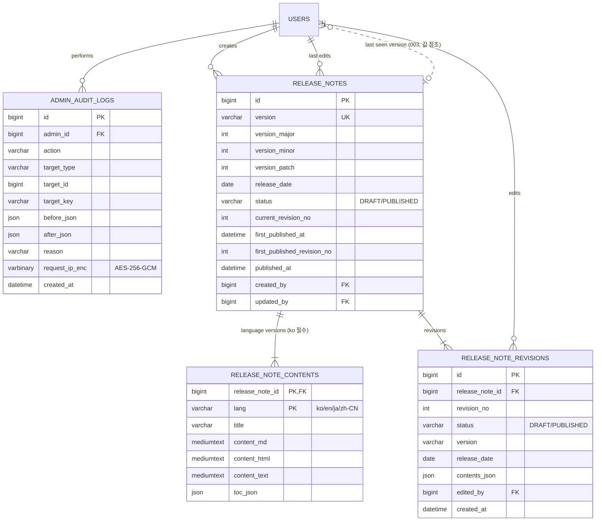

# Data Model: 006 관리 화면

> 이 문서는 [001 data-model](../001-blog-core/data-model.md)을 확장한다. DB 공통 규칙(MySQL 8, utf8mb4, 시간은 UTC `DATETIME(6)`, PK `BIGINT AUTO_INCREMENT`, 공통 컬럼 `created_at`·`updated_at`, 개인정보 AES-256-GCM 암호화)은 001을 따른다. 이 스펙은 아래 새 테이블을 Crowfoot 문서에 더한다([db/README.md](../../db/README.md)). 전체 테이블과 관계는 [erd.md](../../erd.md)에 모았다.

## ERD

001 테이블은 관계만 표시했다. 점선은 외래 키가 없는 값 참조(003의 `users.last_seen_release_version`)다. 공통 컬럼(`created_at`·`updated_at`)은 기록 시각 자체가 의미 있는 경우 외에는 생략했다.

## 001 테이블 변경

없음. 관리자 권한은 001 `users.role`(USER / ADMIN / SUPER_ADMIN, FR-105), 회원별 블로그 한도는 001 `users.max_blogs`(FR-160)를 그대로 쓴다. 예약어는 코드 상수라 테이블이 없다. 관리 메뉴가 다루는 데이터는 각 기능 스펙의 테이블이다(포털 003, 신고·금칙어 005, 외부 블로그 007, 설정값 003 `system_settings`).

- 최고 관리자 최소 1명(FR-105): 권한 변경 트랜잭션에서 `SELECT ... FROM users WHERE role = 'SUPER_ADMIN' AND status = 'ACTIVE' FOR UPDATE`로 잠그고 남는 수를 확인한다.

## admin_audit_logs
관리자 작업 기록 (FR-106, SC-017).

| 컬럼 | 타입 | 제약 / 규칙 |
|---|---|---|
| id | BIGINT | PK |
| admin_id | BIGINT | FK users. 작업한 관리자 |
| action | VARCHAR(50) | 작업 종류(아래 표) |
| target_type | VARCHAR(30) | 대상 종류: USER / TOPIC / CURATION / PORTAL_EXCLUSION / REPORT / POST / COMMENT / GUESTBOOK / TRACKBACK / SETTING / BANNED_WORD / EXTERNAL_BLOG / EXTERNAL_POST / TOPIC_MAPPING_RULE / CLASSIFICATION_REVIEW / RELEASE_NOTE |
| target_id | BIGINT | 대상 ID(숫자 ID가 있는 대상). 외래 키 없음(대상이 지워져도 기록은 남음) |
| target_key | VARCHAR(100) | 숫자 ID가 아닌 대상의 식별 값(설정 키, 릴리스 노트 버전 등) |
| before_json | JSON | 변경 전 값(바뀐 필드만). 개인정보 평문(이메일·IP)은 넣지 않고 회원은 ID로만 적는다 |
| after_json | JSON | 변경 후 값(바뀐 필드만), 같은 규칙 |
| reason | VARCHAR(500) | 관리자가 입력한 사유(정지·숨김·거절 등) |
| request_ip_enc | VARBINARY(128) | 요청 IP, AES-256-GCM 암호문(001 FR-134와 같은 취급) |
| created_at | DATETIME(6) | 작업 시각 |

- 인덱스: (created_at), (admin_id, created_at), (action, created_at), (target_type, target_id).
- 수정·삭제하지 않는다. 애플리케이션에는 INSERT와 조회만 있고, 유일한 삭제는 1년(`blog.admin.audit-retention`, 기본 365일) 지난 행을 지우는 정리 작업이다. 변경 작업과 같은 트랜잭션에서 기록해 작업은 됐는데 기록이 빠지는 일이 없게 한다.
- 개인정보: `request_ip_enc`는 001 개인정보 암호화 규칙을 따르고, `before_json`·`after_json`에는 이메일·IP 평문을 넣지 않는다.

`action` 값(작업이 생기는 스펙):

| action | target_type | 출처 |
|---|---|---|
| USER_SUSPEND, USER_UNSUSPEND | USER | 005 FR-042 |
| USER_BLOG_LIMIT_CHANGE | USER | FR-160 |
| ROLE_GRANT, ROLE_REVOKE | USER | FR-105 |
| TOPIC_CREATE, TOPIC_UPDATE, TOPIC_REORDER, TOPIC_HIDE, TOPIC_UNHIDE, TOPIC_PIN, TOPIC_UNPIN | TOPIC | 003 FR-079, FR-147 |
| CURATION_CREATE, CURATION_UPDATE, CURATION_DELETE | CURATION | 003 FR-091 |
| PORTAL_EXCLUDE, PORTAL_UNEXCLUDE | POST, EXTERNAL_POST | 003 FR-093, 007 FR-123 |
| REPORT_ACTION, REPORT_DISMISS | REPORT | 005 FR-041 |
| CONTENT_HIDE, CONTENT_UNHIDE | POST, COMMENT, GUESTBOOK, TRACKBACK | 005 FR-041 |
| SETTING_CHANGE | SETTING(`target_key` = 설정 키) | 003·005·007 `system_settings` |
| BANNED_WORD_CREATE, BANNED_WORD_UPDATE, BANNED_WORD_DELETE | BANNED_WORD | 005 FR-143 |
| EXTERNAL_BLOG_CREATE, EXTERNAL_BLOG_APPROVE, EXTERNAL_BLOG_REJECT, EXTERNAL_BLOG_PAUSE, EXTERNAL_BLOG_RESUME, EXTERNAL_BLOG_BLOCK | EXTERNAL_BLOG | 007 FR-111, FR-127 |
| EXTERNAL_POST_REMOVE | EXTERNAL_POST | 007 FR-127 |
| TOPIC_MAPPING_RULE_CREATE, TOPIC_MAPPING_RULE_UPDATE, TOPIC_MAPPING_RULE_DELETE | TOPIC_MAPPING_RULE | 007 FR-121 |
| CLASSIFICATION_CONFIRM | CLASSIFICATION_REVIEW | 007 FR-121 |
| RELEASE_NOTE_CREATE, RELEASE_NOTE_UPDATE, RELEASE_NOTE_PUBLISH, RELEASE_NOTE_UNPUBLISH, RELEASE_NOTE_DELETE | RELEASE_NOTE(`target_id` = id, `target_key` = 버전) | FR-167, FR-168 |

새 관리 작업을 더하는 스펙은 이 표에 행을 더한다.

## release_notes
릴리스 노트 (FR-167). 독자 화면은 003 FR-161~166.

| 컬럼 | 타입 | 제약 / 규칙 |
|---|---|---|
| id | BIGINT | PK. 관리자 API 경로의 {id} |
| version | VARCHAR(20) | UNIQUE. SemVer `MAJOR.MINOR.PATCH`(앞자리 0 없음, 사전 배포 표기 없음). 한 번 게시하면 바꿀 수 없음 (FR-167) |
| version_major | INT | NOT NULL. version에서 나눠 저장(정렬·major.minor 묶음용) |
| version_minor | INT | NOT NULL |
| version_patch | INT | NOT NULL. 인덱스 (status, version_major, version_minor, version_patch) |
| release_date | DATE | NOT NULL. 릴리스 날짜(표시용) |
| status | VARCHAR(10) | DRAFT / PUBLISHED (FR-167) |
| current_revision_no | INT | NOT NULL. 지금 내용의 수정본 번호(1부터). 저장마다 +1, PUT의 baseRevisionNo와 비교하는 낙관적 잠금 값 (FR-168) |
| first_published_at | DATETIME(6) | 처음 게시한 시각(게시 중단 후 다시 게시해도 유지). 포털 카드 기간(003 FR-162)과 배너의 "가입 뒤 게시"(003 FR-163) 판단 기준 |
| first_published_revision_no | INT | 처음 게시한 때의 수정본 번호. 독자 "수정 이력"은 이 번호부터 (003 FR-166) |
| published_at | DATETIME(6) | 가장 최근에 게시한 시각, DRAFT면 NULL |
| created_by | BIGINT | FK users. 만든 관리자 |
| updated_by | BIGINT | FK users. 마지막으로 저장한 관리자 |

- 상태 전이: (만들기) → DRAFT → PUBLISHED(게시: `published_at = now`, 처음이면 `first_published_at`·`first_published_revision_no` 설정) → DRAFT(게시 중단: `published_at = NULL`, `first_published_*`는 유지) → PUBLISHED …
- `first_published_at`이 있는(한 번이라도 게시한) 노트는 `version` 변경과 삭제를 거부한다(고유 주소 `/updates/v{version}` 보존). 한 번도 게시하지 않은 초안은 삭제할 수 있고, 이때 언어판·수정본 행도 함께 지운다(작업 기록은 남음).
- `version`은 저장할 때 `^(0|[1-9]\d*)\.(0|[1-9]\d*)\.(0|[1-9]\d*)$`로 검사하고 major·minor·patch로 나눠 저장한다. 정렬과 "가장 높은 버전"은 이 세 숫자로 한다.

## release_note_contents
언어판 (FR-167). 노트당 1~4행.

| 컬럼 | 타입 | 제약 / 규칙 |
|---|---|---|
| release_note_id | BIGINT | FK release_notes |
| lang | VARCHAR(5) | ko / en / ja / zh-CN. ko 행은 항상 있어야 함(서비스 검증) |
| title | VARCHAR(200) | NOT NULL. 언어판 제목 |
| content_md | MEDIUMTEXT | NOT NULL. 원문 Markdown(최대 100,000자) |
| content_html | MEDIUMTEXT | 글 본문과 같은 과정으로 변환·살균한 HTML, 제목(h2~h4)에 id 앵커 |
| content_text | MEDIUMTEXT | 태그 제거 텍스트(검색·일치 부분 표시용) |
| toc_json | JSON | 자동 목차 `[{ level, text, anchor }]` |

- FULLTEXT `ft_release_note_contents (title, content_text) WITH PARSER ngram` — 003 FR-165 검색.
- 저장할 때마다 HTML·텍스트·목차를 다시 만든다. 변환과 살균은 글 본문과 같은 과정(001 research R8, R24, R25, R27)이며, 제목 앵커 규칙은 001 contracts/api.md의 ReleaseNoteDetail 설명을 따른다.
- 요청에서 빠진 언어판은 행을 지운다. ko 행을 지우는 요청은 거부한다.
- 본문에 이미지 올리기는 1.0 범위 밖이므로 001 media·post_media와 연결하지 않는다(외부 이미지 주소는 살균 규칙과 CSP를 따른다).

## release_note_revisions
수정본 (FR-168). 저장할 때마다 저장된 뒤의 전체 상태를 한 행으로 남긴다. 만들기가 수정본 1이다.

| 컬럼 | 타입 | 제약 / 규칙 |
|---|---|---|
| id | BIGINT | PK |
| release_note_id | BIGINT | FK release_notes |
| revision_no | INT | UNIQUE(release_note_id, revision_no). 1부터 |
| status | VARCHAR(10) | 저장 당시 노트 상태 DRAFT / PUBLISHED |
| version | VARCHAR(20) | 저장 당시 버전 |
| release_date | DATE | 저장 당시 릴리스 날짜 |
| contents_json | JSON | 저장 당시 모든 언어판 `{ "ko": { "title", "contentMarkdown" }, ... }`. HTML은 볼 때 다시 변환 |
| edited_by | BIGINT | FK users. 저장한 관리자(독자에게는 보이지 않음) |
| created_at | DATETIME(6) | 저장 시각 |

- 수정·삭제하지 않는다(초안 삭제 때만 함께 지움). 게시·게시 중단은 내용이 바뀌지 않으므로 수정본을 만들지 않고 작업 기록에만 남긴다.
- 저장: `UPDATE release_notes SET current_revision_no = current_revision_no + 1, ... WHERE id = ? AND current_revision_no = :baseRevisionNo` — 바뀐 행이 0이면 409 `RELEASE_NOTE_REVISION_CONFLICT`. 같은 트랜잭션에서 contents 교체와 수정본 INSERT, 작업 기록 INSERT.

## 읽기 쿼리 (003 FR-163~166)

- 독자 "수정 이력"(003 FR-166): `revision_no >= first_published_revision_no`인 수정본만, `created_at`과 번호만 준다(`edited_by`는 주지 않음).
- 검색(003 FR-165): PUBLISHED 노트마다 보여줄 언어판(요청 언어 → en → ko 중 처음 있는 것) 하나를 고른 뒤 그 행에서만 `MATCH(title, content_text) AGAINST (? IN BOOLEAN MODE)`로 찾는다. 다른 언어판에서만 맞는 노트는 결과에 넣지 않는다. 노트 수가 적으므로(수십~수백) 이 방식으로 충분하다.
- 이전·다음 버전(003 FR-164): PUBLISHED 노트를 (major, minor, patch)로 정렬해 바로 앞·뒤 행.

## plan 단계에서 확정한 값 (2026-10-07)

[plan.md](./plan.md) "스키마 변경"에서 006 쿼리를 `db/schema-mysql.sql`과 대조했다. 위 테이블·인덱스는 그대로 쓰며 **필수 DDL은 없다**. 아래는 plan에서 정한 값이다(근거는 [research.md](./research.md)).

- `admin_audit_logs.action`: 코드 상수는 backend `admin/audit/AuditActions` 한 곳이고 `AuditActions.ALL`이 전체 목록이다(research A6). 001의 `USER_BLOG_LIMIT_CHANGE`는 지금 `AdminUserService`의 문자열 상수라 `AuditActions`로 옮긴다. 006이 쓰는 값은 `USER_BLOG_LIMIT_CHANGE`, `ROLE_GRANT`, `ROLE_REVOKE`(target `USER`, before/after `{ "role": "ADMIN" }` 형태)와 003의 `RELEASE_NOTE_*`다.
- 권한 변경의 기록 구분: 권한이 높아지면(USER → ADMIN, USER·ADMIN → SUPER_ADMIN) `ROLE_GRANT`, 낮아지면 `ROLE_REVOKE`. 같은 값이면 기록하지 않는다.
- `request_ip_enc`: 작업 기록 상세 API에서 최고 관리자에게만 복호화해 보여준다(목록에는 없음).
- 보관: `blog.admin.audit-retention` 기본 365일(30일 미만이면 기동 실패), 정리 작업 `blog.jobs.audit-purge-cron` 기본 매일 05:15, `blog.jobs.purge-batch-size`(500)씩 id를 모아 삭제(research A7). 리포지토리 `AdminAuditLogRepository`에는 여전히 삭제가 없고 정리 전용 `AdminAuditPurgeRepository`만 지운다.
- 최고 관리자 최소 1명: 위 "001 테이블 변경"의 잠금 쿼리를 `admin/SuperAdminGuard`에 두고 006 권한 변경과 005 정지가 함께 쓴다. 추가로 최고 관리자는 자기 권한을 바꿀 수 없다(422 `CANNOT_CHANGE_OWN_ROLE`).
- `release_notes`·`release_note_contents`·`release_note_revisions`: 003이 구현한 저장 규칙을 그대로 쓴다. 006은 화면만 더하고 저장 규칙을 바꾸지 않는다. 수정본 "되돌리기"는 수정본 내용으로 편집기를 채워 다시 저장(새 수정본)하는 방식이며 테이블 변경이 없다.
- 선택 인덱스 제안 4개(`idx_users_created`, `idx_posts_published_at`, `idx_comments_status_created`, `idx_guestbook_entries_status_created`)는 plan.md "스키마 변경"에 정확한 DDL이 있고 Crowfoot `plan_migration` → marco 승인 전에는 만들지 않는다. 승인되면 이 문서와 [erd.md](../../erd.md)에 인덱스를 더한다.
