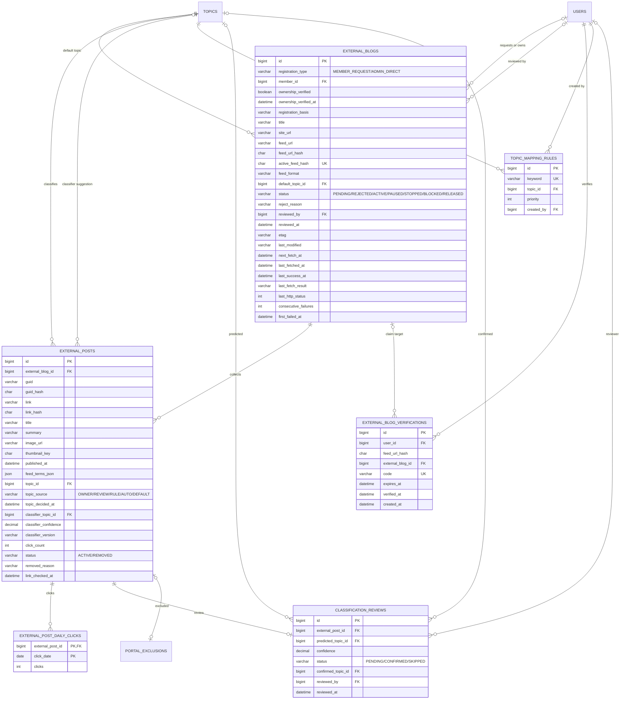

# Data Model: 007 외부 블로그 RSS 수집과 주제 자동 분류

> 이 문서는 [001 data-model](../001-blog-core/data-model.md)을 확장한다. DB 공통 규칙(MySQL 8, utf8mb4, 시간은 UTC `DATETIME(6)`, PK `BIGINT AUTO_INCREMENT`, 공통 컬럼 `created_at`·`updated_at`, 개인정보 AES-256-GCM 암호화)은 001을 따른다. 외부 글은 001 글 노출 매트릭스의 대상이 아니며 포털에만 나온다(FR-123~125). 주제·포털 제외·설정값은 [003 data-model](../003-portal/data-model.md)을 쓴다. 이 스펙은 아래 새 테이블과 003 테이블 변경을 Crowfoot 문서에 더한다([db/README.md](../../db/README.md)). 전체 테이블과 관계는 [erd.md](../../erd.md)에 모았다.

## ERD

001·003 테이블은 관계만 표시했다. 공통 컬럼(`created_at`·`updated_at`)은 기록 시각 자체가 의미 있는 경우 외에는 생략했다.

## 기존 테이블 변경 (003)

| 테이블.컬럼 | 타입 | 구분 | 내용 |
|---|---|---|---|
| portal_exclusions.external_post_id | BIGINT | 추가 | FK external_posts, UNIQUE, NULL 가능. 포털에서 제외한 외부 글 (FR-123이 003 FR-093을 적용) |
| portal_exclusions.post_id | BIGINT | 변경 | NULL 허용으로 변경. CHECK ((post_id IS NULL) <> (external_post_id IS NULL)): 내부 글과 외부 글 중 정확히 하나 |

- 002 `notifications.type`의 EXTERNAL_BLOG_APPROVED·EXTERNAL_BLOG_REJECTED·EXTERNAL_FEED_STOPPED, 005 `reports.target_type`의 EXTERNAL_POST·EXTERNAL_BLOG, 006 작업 기록의 EXTERNAL_* 값은 각 문서에 이미 있다.
- 003 `system_settings`에 더하는 키:

| setting_key | 기본값(프로퍼티) | 설명 |
|---|---|---|
| external.fetch-interval | `PT30M` (`blog.external.fetch-interval`) | 수집 주기 (FR-113) |
| external.auto-classify-min-confidence | `0.7` | 자동 분류 채택 기준 (FR-118, FR-119) |
| external.score-weight | `1.0` | 외부 글 인기 점수 가중치(내부 글 대비) (FR-124) |

## external_blogs
외부 블로그 등록과 피드 수집 상태 (FR-109~113, FR-116, FR-117, FR-126~129, FR-157). 등록 정보와 수집 상태가 1:1이므로 한 테이블에 둔다(research E1의 "수집할 차례인 피드" 조회 대상이 이 테이블이다).

| 컬럼 | 타입 | 제약 / 규칙 |
|---|---|---|
| id | BIGINT | PK |
| registration_type | VARCHAR(15) | MEMBER_REQUEST(회원 신청) / ADMIN_DIRECT(운영자 직접 등록) (FR-111) |
| member_id | BIGINT | FK users, NULL 가능. 신청·소유 회원(관리 권한자). 운영자 직접 등록이고 아무도 넘겨받지 않았으면 NULL. 소유 인증으로 넘겨받으면 그 회원으로 바뀜 (FR-129) |
| ownership_verified | BOOLEAN | NOT NULL DEFAULT false. 소유 인증 여부. false면 포털에 썸네일 없이 노출 (FR-128) |
| ownership_verified_at | DATETIME(6) | 인증 시각 |
| registration_basis | VARCHAR(500) | 등록 근거(ADMIN_DIRECT 필수, 예: "피드 공개 배포") |
| title | VARCHAR(200) | 블로그 이름(피드에서 읽음) |
| site_url | VARCHAR(1000) | 블로그 주소 |
| feed_url | VARCHAR(1000) | NOT NULL. RSS·Atom 주소 |
| feed_url_hash | CHAR(64) | SHA-256(정규화한 feed_url: 스킴 제거(http·https 같게), 소문자 호스트, 기본 포트·끝 `/`·조각 제거 — research E6) |
| active_feed_hash | CHAR(64) | 생성 컬럼 `IF(status IN ('REJECTED','RELEASED'), NULL, feed_url_hash)` STORED, UNIQUE. 거절·해제되지 않은 등록은 피드당 하나 (FR-112) |
| feed_format | VARCHAR(10) | RSS / ATOM |
| default_topic_id | BIGINT | FK topics, NOT NULL. 기본 주제(소분류) |
| status | VARCHAR(10) | PENDING(승인 대기) / REJECTED(거절) / ACTIVE(수집 중) / PAUSED(일시 중지) / STOPPED(연속 실패 자동 중지) / BLOCKED(차단) / RELEASED(해제 — 수집은 멈추고, 주인이 글을 남겼으면 남은 `ACTIVE` 글은 포털에 계속 노출) |
| reject_reason | VARCHAR(500) | 거절 사유(신청자에게 알림) |
| reviewed_by | BIGINT | FK users, NULL 가능. 승인·거절·직접 등록한 관리자 |
| reviewed_at | DATETIME(6) | 승인·거절·직접 등록 시각 |
| etag | VARCHAR(255) | 마지막 응답의 ETag(If-None-Match에 씀) (FR-116) |
| last_modified | VARCHAR(64) | 마지막 응답의 Last-Modified 원문(If-Modified-Since에 씀) |
| next_fetch_at | DATETIME(6) | 다음 수집 시각. ACTIVE일 때만 값. 인덱스 (status, next_fetch_at) (research E1) |
| last_fetched_at | DATETIME(6) | 마지막 시도 시각 |
| last_success_at | DATETIME(6) | 마지막 성공(200 또는 304) 시각 |
| last_fetch_result | VARCHAR(20) | OK / NOT_MODIFIED / HTTP_ERROR / TIMEOUT / TOO_LARGE / PARSE_ERROR / BLOCKED_ADDRESS / DNS_ERROR |
| last_http_status | INT | 마지막 HTTP 상태 코드 |
| consecutive_failures | INT | NOT NULL DEFAULT 0. 연속 실패 수(성공하면 0). 다음 시도 지연(30분→…→12시간) 계산 |
| first_failed_at | DATETIME(6) | 연속 실패가 시작된 시각(성공하면 NULL). 이로부터 7일이면 STOPPED (FR-117) |

- 인덱스: (status, next_fetch_at) 스케줄러, (member_id, status) 회원별 한도, UNIQUE(active_feed_hash).
- **회원별 한도(FR-112)**: 신청·넘겨받기 트랜잭션에서 회원 행을 `SELECT ... FOR UPDATE`로 잠그고 `member_id = ? AND status NOT IN ('REJECTED','RELEASED')` 수가 3 이상이면 거부(001 R28과 같은 방식). 운영자 직접 등록은 member_id가 NULL이라 세지 않는다.
- **상태 전이**:

| 전이 | 누가 | 함께 바뀌는 것 |
|---|---|---|
| (신청) → PENDING | 회원 | `registration_type = MEMBER_REQUEST`, `member_id` |
| (직접 등록) → ACTIVE | 관리자 | `registration_type = ADMIN_DIRECT`, `registration_basis`, `reviewed_by/at`, `next_fetch_at = now`, 남긴 글 이어받기(아래) |
| PENDING → ACTIVE | 관리자 승인 | `reviewed_by/at`, `next_fetch_at = now`, 알림 EXTERNAL_BLOG_APPROVED, 남긴 글 이어받기(아래) |
| PENDING → REJECTED | 관리자 거절 | `reject_reason`, 알림 EXTERNAL_BLOG_REJECTED |
| ACTIVE → PAUSED, PAUSED·STOPPED → ACTIVE | 관리자 | `next_fetch_at` NULL / now. 이미 수집된 글은 포털에 그대로 |
| ACTIVE → STOPPED | 수집 작업 | `now - first_failed_at >= 7일`일 때, 알림 EXTERNAL_FEED_STOPPED (FR-117) |
| BLOCKED가 아닌 모든 상태 → BLOCKED | 관리자 | 모든 외부 글 `REMOVED`(`BLOG_BLOCKED`), `next_fetch_at` NULL. 같은 피드의 RELEASED 등록에 남은 `ACTIVE` 글도 `REMOVED`(`BLOG_BLOCKED`). RELEASED 등록을 차단할 때 같은 피드에 거절·해제가 아닌 다른 등록이 있으면 409(그 등록을 차단) |
| PENDING·ACTIVE·PAUSED·STOPPED → RELEASED | 관리 회원(해제, `deletePosts` 필수) | 수집 중지(`next_fetch_at` NULL). **글 남기기**: 글 행 그대로 → 포털에 계속 노출. **글 삭제**: 같은 트랜잭션에서 external_posts 행 삭제(보관 없음) → 포털에서 바로 사라짐 (FR-126) |
| RELEASED → RELEASED(남긴 글 삭제) | 관리 회원 | 남은 external_posts 행 삭제. 상태는 그대로 (FR-126) |
| 거절·해제가 아닌 상태 → RELEASED | 회원 탈퇴 | 그 회원의 모든 등록(이미 글을 남기고 해제한 것 포함)의 `ACTIVE` 외부 글 `REMOVED`(`MEMBER_WITHDRAWN`) (FR-157) |

- **해제 후 글(결정 표 24번)**: "글 남기기"와 "글 삭제"의 선택은 따로 저장하지 않는다. 삭제를 고르면 글 행이 없어지고, 남기면 RELEASED 등록에 `ACTIVE` 글 행이 남는다. 그래서 "RELEASED 등록의 `ACTIVE` 글 = 주인이 남긴 글"이고 포털 노출 조건은 블로그 상태에 RELEASED를 더하기만 하면 된다(탈퇴로 해제된 등록의 글은 `REMOVED`). 해제 뒤 관리 회원(`member_id` 그대로)은 조회와 남긴 글 삭제만 하고, 주제 변경은 409. 남긴 글은 기한 없이 두며, RELEASED 등록의 `REMOVED` 글만 내린 지 30일 뒤 정리 작업이 지운다(research E15).
- **다시 등록 시 남긴 글 이어받기(결정 표 24번)**: 새 등록이 ACTIVE가 되는 트랜잭션(승인·직접 등록)에서 같은 `feed_url_hash`의 RELEASED 등록에 남은 글 중 `removed_reason`이 `MEMBER_WITHDRAWN`이 아닌 것의 `external_blog_id`를 새 등록으로 바꾼다. 새 등록은 첫 수집 전이라 글이 없어 UNIQUE와 충돌하지 않고, 첫 수집은 같은 글을 갱신만 한다(같은 글이 포털에 두 번 나오지 않음). 주제·클릭 수·내림 결정이 이어지고, 관리 권한은 새 등록의 관리 회원에게 간다.
- **넘겨받기(FR-129)**: 소유 인증에 성공한 회원이 다른 회원(또는 NULL)이 가진 등록을 넘겨받으면 `member_id`를 바꾸고 `ownership_verified = true`. 이전 회원에게는 별도 알림이 없다(1.0).
- **수집**(research E1): `status = ACTIVE AND next_fetch_at <= now`인 행을 고른다. 성공(200·304)하면 `consecutive_failures = 0`, `first_failed_at = NULL`, `etag`·`last_modified` 갱신, `next_fetch_at = now + 주기 + 무작위 0~5분`. 실패하면 `consecutive_failures + 1`, `first_failed_at`이 NULL이면 now, `next_fetch_at`을 30분→1시간→…→12시간으로 늦춘다.
- 내부망·서비스 자신(blog.java21.net) 주소는 등록과 수집에서 모두 거부한다(FR-116, Edge Cases).

## external_blog_verifications
소유 인증 코드 (FR-110, FR-129).

| 컬럼 | 타입 | 제약 / 규칙 |
|---|---|---|
| id | BIGINT | PK |
| user_id | BIGINT | FK users. 인증하는 회원 |
| feed_url_hash | CHAR(64) | 인증 대상 피드(external_blogs.feed_url_hash와 같은 계산). 등록 전 신청 단계에서도 쓰므로 해시로 연결 |
| external_blog_id | BIGINT | FK external_blogs, NULL 가능. 이미 있는 등록을 넘겨받을 때, 또는 신청이 만들어진 뒤 연결 |
| code | VARCHAR(32) | UNIQUE. 발급한 인증 코드(무작위) |
| expires_at | DATETIME(6) | 발급 + 24시간 (FR-110) |
| verified_at | DATETIME(6) | 인증 성공 시각 |
| created_at | DATETIME(6) | 발급 시각 |

- 인덱스: (user_id, feed_url_hash, created_at DESC).
- 신청 단계(아직 external_blogs 행이 없을 수 있음)에서도 발급하므로 피드 해시로 대상을 정한다. 신청이 만들어지면 같은 회원·같은 해시의 인증 성공 행을 그 등록에 연결해 `ownership_verified = true`로 둔다.
- 인증 확인은 피드와 블로그 페이지에서 `code`를 찾는다(내부망 차단 규칙 동일). 만료된 코드는 정리 작업이 지운다.

## external_posts
수집한 외부 글 (FR-114, FR-115, FR-117~120, FR-123~125, FR-128).

| 컬럼 | 타입 | 제약 / 규칙 |
|---|---|---|
| id | BIGINT | PK |
| external_blog_id | BIGINT | FK external_blogs |
| guid | VARCHAR(1000) | 피드의 고유값(RSS guid, Atom id), 없으면 NULL |
| guid_hash | CHAR(64) | SHA-256(guid). UNIQUE(external_blog_id, guid_hash) (FR-115) |
| link | VARCHAR(2000) | NOT NULL. 원문 주소 |
| link_hash | CHAR(64) | SHA-256(정규화한 link). UNIQUE(external_blog_id, link_hash). guid가 없을 때 같은 글 판단 |
| title | VARCHAR(300) | 제목(태그 제거) |
| summary | VARCHAR(200) | 요약: 태그 제거 텍스트 최대 200자. 본문 전체는 저장하지 않음 (FR-114, SC-021) |
| image_url | VARCHAR(1000) | 피드의 대표 이미지 원본 주소 |
| thumbnail_key | CHAR(22) | backend가 받아 줄여 저장한 썸네일의 키(001 research R27). 소유 인증 블로그 글만 받고 노출 (FR-128). 저장·제공 방식은 [research E7](./research.md) |
| published_at | DATETIME(6) | 피드의 발행 시각 |
| feed_terms_json | JSON | 피드의 카테고리·태그 원문 배열(매핑 규칙·자동 분류 입력) |
| topic_id | BIGINT | FK topics, NOT NULL. 최종 주제(소분류) |
| topic_source | VARCHAR(10) | OWNER(블로그 주인) / REVIEW(운영자 검수) / RULE(매핑 규칙) / AUTO(자동 분류) / DEFAULT(블로그 기본 주제). OWNER·REVIEW는 자동 분류가 덮어쓰지 않음 (FR-118, FR-120) |
| topic_decided_at | DATETIME(6) | 사람이 주제를 정한 시각(OWNER·REVIEW). 정확도 지표의 "최근 30일 사람이 확인한 글" (FR-122) |
| classifier_topic_id | BIGINT | FK topics, NULL 가능. 자동 분류가 낸 주제(채택 여부와 관계없이 보관) |
| classifier_confidence | DECIMAL(4,3) | 자동 분류 신뢰도 0~1 |
| classifier_version | VARCHAR(30) | 분류 방식 식별자(교체 추적, FR-119) |
| click_count | INT | NOT NULL DEFAULT 0. 포털 카드 클릭 누적 (FR-124) |
| status | VARCHAR(10) | ACTIVE / REMOVED(포털에서 내림) |
| removed_reason | VARCHAR(20) | LINK_BROKEN / BLOG_BLOCKED / MEMBER_WITHDRAWN / REPORT / ADMIN |
| link_checked_at | DATETIME(6) | 마지막 원문 링크 점검 시각(주 1회, FR-117) |

- 인덱스: (status, published_at DESC) 포털 최신, (topic_id, status, published_at DESC) 주제 페이지, (external_blog_id, published_at DESC) 회원의 수집된 글 목록, (status, link_checked_at) 링크 점검.
- **같은 글(FR-115)**: `guid_hash`가 있으면 그것으로, 없으면 `link_hash`로 찾아 있으면 제목·요약·이미지·발행 시각을 갱신한다. 등록할 때는 최근 30일 글만 넣는다(FR-113).
- **본문 저장 금지(SC-021)**: 피드 본문은 요약(200자) 계산에만 쓰고 저장하지 않는다.
- **주제 결정(FR-118)**: OWNER·REVIEW이면 유지. 아니면 매핑 규칙(topic_mapping_rules) → 자동 분류(신뢰도 ≥ `external.auto-classify-min-confidence`) → 블로그 기본 주제 순. 자동 분류 신뢰도가 기준 미만이면 DEFAULT로 노출하고 classification_reviews에 PENDING 행을 만든다(FR-119).
- **포털 노출**(FR-123): `external_posts.status = ACTIVE` AND `external_blogs.status IN (ACTIVE, PAUSED, STOPPED, RELEASED)` AND 포털 제외(003 portal_exclusions.external_post_id) 없음 AND 주제가 운영자 숨김이 아님(주제 페이지). 썸네일은 `external_blogs.ownership_verified = true`일 때만(FR-128). 외부 글은 검색·RSS·사이트맵 쿼리에 넣지 않는다(FR-125).
- **인기 점수(FR-124)**: external_post_daily_clicks 최근 7일 클릭 수 × `external.score-weight`(시간 감쇠는 003 FR-086과 같은 함수). 저장하지 않고 포털 목록과 함께 5분 캐시.
- **정확도 지표(FR-122)**: `topic_decided_at`이 최근 30일이고 `classifier_topic_id`가 있는 글 중 `classifier_topic_id = topic_id` 비율.
- 원문 링크 점검(주 1회)에서 열리지 않으면 `REMOVED`(`LINK_BROKEN`).

## external_post_daily_clicks
포털 카드 클릭 수 (FR-124).

| 컬럼 | 타입 | 제약 / 규칙 |
|---|---|---|
| external_post_id | BIGINT | FK external_posts |
| click_date | DATE | UTC 날짜 |
| clicks | INT | NOT NULL DEFAULT 0. 같은 방문자 30분 중복 제거 후 수 |

- 카드 클릭은 backend를 거쳐 원문으로 이동(리다이렉트)하며 그때 `external_posts.click_count + 1`과 이 행 upsert를 한다(경로는 007 contracts). 같은 방문자 중복 제거는 Caffeine(조회수와 같은 방식). 90일 지난 행은 지운다.

## topic_mapping_rules
매핑 규칙 (FR-118, FR-121).

| 컬럼 | 타입 | 제약 / 규칙 |
|---|---|---|
| id | BIGINT | PK |
| keyword | VARCHAR(100) | UNIQUE. 피드 카테고리·태그와 비교할 값(정규화: NFKC, 앞뒤 공백 제거, 소문자). 완전 일치 |
| topic_id | BIGINT | FK topics. 대상 주제(소분류) |
| priority | INT | NOT NULL DEFAULT 0. 한 글에 여러 규칙이 맞으면 큰 값 먼저, 같으면 id가 작은 규칙 |
| created_by | BIGINT | FK users. 만든 관리자 |

- 피드의 카테고리·태그(`feed_terms_json`)를 같은 정규화로 바꿔 `keyword`와 완전 일치하는 규칙을 찾는다. 규칙을 바꿔도 이미 수집된 글은 다시 분류하지 않는다(이후 수집분부터, 수용 시나리오 US3-5).

## classification_reviews
분류 검수 목록 (FR-119, FR-121, FR-122).

| 컬럼 | 타입 | 제약 / 규칙 |
|---|---|---|
| id | BIGINT | PK |
| external_post_id | BIGINT | FK external_posts, UNIQUE(글당 하나) |
| predicted_topic_id | BIGINT | FK topics, NULL 가능. 자동 분류 결과 |
| confidence | DECIMAL(4,3) | 자동 분류 신뢰도(기준 미만이라 검수 대상) |
| status | VARCHAR(10) | PENDING(대기) / CONFIRMED(확정) / SKIPPED(주인이 먼저 주제를 정해 검수 불필요) |
| confirmed_topic_id | BIGINT | FK topics, NULL 가능. 운영자가 확정한 주제 |
| reviewed_by | BIGINT | FK users, NULL 가능. 검수한 관리자 |
| reviewed_at | DATETIME(6) | 확정 시각 |

- 인덱스: (status, created_at).
- 운영자가 확정하면 `CONFIRMED`, `external_posts.topic_id = confirmed_topic_id`, `topic_source = REVIEW`, `topic_decided_at = now`. 블로그 주인이 먼저 주제를 바꾸면(FR-120) `SKIPPED`.

## plan에서 확정한 값

계획 단계([plan.md](./plan.md), [research.md](./research.md))에서 정한 값이다. 테이블·컬럼은 바뀌지 않았다(필수 DDL 없음, 선택 인덱스 제안 1개는 plan.md "스키마 변경").

| 항목 | 확정 값 | 근거 |
|---|---|---|
| 피드 주소 정규화 | 스킴 제거(http·https를 같은 피드로), 호스트 소문자·IDN은 ASCII, 기본 포트·끝 `/`·조각 제거, 쿼리 유지. `link_hash`도 같은 함수 | research E6 |
| `feed_url` 저장 값 | 리다이렉트를 따라간 최종 주소 | research E2 |
| 요약(`summary`) | 태그를 지운 일반 텍스트, 코드 포인트 200자(넘으면 199자 + "…"). HTML로 저장·렌더링하지 않음 | research E4 |
| 대표 이미지(`image_url`) | enclosure(image/*) → Media RSS `media:thumbnail`·`media:content` → 본문 첫 ``(1×1 추적 픽셀 제외). http/https만 | research E4 |
| 썸네일 파일 | 소유 인증 블로그 글만 받아 600x400 cover 한 크기, `{blog.media.thumbnail-dir}/external/{key 앞 2자}/{key}.{jpg\|png}`, 주소 `/media/external/{key}`(원본 저장 안 함). 인증이 나중에 되면 최근 30일 글 최대 100개 소급 | research E7 |
| `published_at` | 발행 → 수정 시각 → 처음 수집한 시각. 미래 시각은 수집 시각으로 | research E4 |
| 최초 수집 범위 | `last_success_at`이 NULL인 첫 성공 수집만 최근 30일, 한 번에 최대 100개 | research E5 |
| 같은 글 갱신 | 제목·요약·이미지 주소·발행 시각·카테고리만 갱신, 주제는 다시 정하지 않음, REMOVED는 되살리지 않음 | research E5 |
| 수집 임대 | 고른 행의 `next_fetch_at`을 `now + 10분`으로 미뤄 두고 수집 결과로 다시 정함 | research E1 |
| 실패 지연 | `min(30분 × 2^(실패 수 - 1), 12시간)`, 첫 실패부터 7일이면 STOPPED | research E5 |
| 인증 코드(`code`) | `java21-verify-` + base62 12자(26자), 같은 회원·피드에 유효한 코드가 있으면 재사용 | research E8 |
| 회원 한도에서 세는 상태 | `REJECTED`·`RELEASED`를 뺀 전부(BLOCKED 포함). 넘겨받기도 셈 | research E8 |
| 관리 권한 | `member_id` 회원: 조회·해제. 글 주제·기본 주제 변경은 `ownership_verified = true`일 때만 | tasks 결정 표 18번 |
| 자동 분류 | `KeywordTopicClassifier`, `classifier_version = 'keyword-v1'`, 신뢰도 `(top/sum) × min(1, top/4)` | research E9 |
| 검수 행 생성 | 주제가 RULE이 아니고 자동 분류 신뢰도가 기준 미만(일치 없음 포함)인 새 글. ACTIVE 글의 PENDING만 목록에 | research E10 |
| 포털 노출(외부) | 글 ACTIVE, 블로그 ACTIVE·PAUSED·STOPPED·RELEASED(RELEASED는 글을 남긴 해제), 포털 제외 없음, `published_at <= now`, 주제가 운영자 숨김 아님 | research E13, 결정 표 24번 |
| 해제 후 글 | 해제하는 주인이 고름(marco 2026-10-07). "남기기"면 글 행을 그대로 두고 포털에 계속 노출(새 글 수집 없음, 보관 기한 없음, 나중에 주인이 삭제 가능). "삭제"면 같은 트랜잭션에서 바로 행 삭제(30일 보관 없음). 차단·탈퇴·신고 처리 때는 남긴 글도 내림. 같은 피드가 다시 ACTIVE가 되면 남긴 글을 새 등록이 이어받음. 선택을 저장하는 컬럼 없음(스키마 변경 없음) | research E16, 결정 표 24번 |
| 클릭 | 같은 방문자·같은 글 30분 1회, `click_count`와 일별 행을 같은 트랜잭션에서, 일별 행 90일 보관 | research E14 |
| 원문 링크 점검 | 주 1회, HEAD(405·501이면 GET 0바이트), 404·410·도메인 없음만 `LINK_BROKEN` | research E12 |
| 운영 설정 범위 | `external.fetch-interval` PT10M~PT24H, `external.auto-classify-min-confidence` 0~1, `external.score-weight` 0~10 | contracts/api.md |
| 작업 기록 값 추가 | 006 data-model 표의 값 + `EXTERNAL_BLOG_UPDATE`(관리자의 기본 주제 변경, 대상 EXTERNAL_BLOG) | contracts/api.md |

